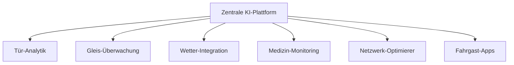

# SmartRail-AI – KI-gestützte Lösung zur Reduzierung von Zugverspätungen

[-blue)](LICENSE.md)
[](README.md)
[](README.md)
[](README.md)

## 📋 Überblick

**SmartRail-AI** ist eine innovative KI-Plattform zur drastischen Reduzierung von Zugverspätungen durch intelligente Vorhersage und Prävention der Hauptursachen. Das System adressiert systematisch die kritischsten Verzögerungsquellen im Bahnverkehr und optimiert das gesamte Netzwerk in Echtzeit.

### 🎯 Projektmission
Transformation des Bahnverkehrs durch KI-gestützte Prävention statt Reaktion – für pünktlichere, sicherere und effizientere Züge.

### ✨ **Neue Version 2.0 - Modernisierte Benutzeroberfläche**
- **🔍 Intelligente Suchfunktion** - Sofortiges Finden aller Module
- **📂 Kategorisierte Navigation** - Organisiert in logische Gruppen (KI, Quantum, Maintenance, etc.)
- **⭐ Favoriten-System** - Schnellzugriff auf am häufigsten genutzte Module
- **🎨 Professionelles Design** - Moderne Karten mit Animationen und Dégradés
- **📱 Responsive Layout** - Optimiert für Desktop und Mobile
- **⚡ Performance-Optimiert** - Schnellere Navigation und bessere UX

## 🚂 Hauptprobleme im Bahnverkehr

### 1. 🚪 Türblockaden durch Fahrgäste (15-20% aller Verspätungen)
- Fahrgäste halten Türen auf oder springen in letzter Sekunde ein
- Führt zu kumulativen Verspätungen im gesamten Netz

### 2. 🚷 Personen auf Gleisen (10-15% aller Verspätungen)
- Suizidversuche und Unfälle
- Unbefugte Gleisbetreter
- Tiere auf den Schienen

### 3. 🌪️ Naturkatastrophen & Unwetter (20-25% aller Verspätungen)
- Stürme, umgestürzte Bäume
- Überschwemmungen und Erdrutsche
- Extreme Witterungsbedingungen

### 4. ❤️ Medizinische Notfälle (5-10% aller Verspätungen)
- Fahrgäste kollabieren oder benötigen Hilfe
- Verzögerungen durch Rettungseinsätze

### 5. 🔗 Domino-Effekte (30-40% aller Verspätungen)
- Eine Verspätung führt zu Folgeverspätungen
- Suboptimale Netzwerkkoordination

## ⚡ SmartRail-AI Lösungsansatz

### 🧠 KI-Module für präventive Intelligenz

#### 1. 🚪 **Tür-Intelligenz-System**
```
📹 Videoanalyse der Türbereiche
🤖 KI erkennt herannahende Fahrgäste
⚖️ Echtzeitentscheidung: Warten oder Schließen?
📊 Optimiert Gesamtverspätung vs. Einzelverspätung
```

**Technologie:**
- Computer Vision mit Echtzeit-Personenerkennung
- Laufgeschwindigkeits- und Entfernungsanalyse
- Predictive Analytics für optimale Türschließzeiten
- Integration mit Zugsteuerungssystemen

#### 2. 🚷 **Gleis-Überwachung & Suizidprävention**
```
📡 Kamera- und Sensornetzwerk entlang der Gleise
🚨 KI-Anomalieerkennung für ungewöhnliche Aktivitäten
📍 Hotspot-Vorhersage für Risikogebiete
🚁 Proaktive Entsendung von Personal/Drohnen
```

**Ethische KI-Implementierung:**
- Anonyme Personenerkennung (keine Gesichtserkennung)
- Menschenwürde-respektierende Alarmierung
- Präventive Hilfe statt reaktive Maßnahmen
- Datenschutz-konforme Datenverarbeitung

#### 3. 🌪️ **Wetter & Naturkatastrophen-Vorhersage**
```
🛰️ Satellitendaten-Integration
🌦️ KI-gestützte Wettervorhersage
🚁 Drohnen-Patrouillen für Gleisinspektion
📊 Risikobewertung in Echtzeit
```

**Präventive Maßnahmen:**
- Automatische Geschwindigkeitsanpassung bei Wetterrisiken
- Umleitung von Zügen vor Unwettern
- Proaktive Wartungsmaßnahmen
- Echtzeitwarnungen an Betriebszentralen

#### 4. ❤️ **Medizinische Notfall-Überwachung**
```
📱 Onboard-KI überwacht Fahrgastverhalten
🚨 Erkennt Stürze und medizinische Notfälle
📞 Automatische Alarmierung von Sanitätern
📍 Präzise Waggon-Lokalisation für Ersthelfer
```

#### 5. 🧠 **Zentrale Netzwerk-Optimierung**
```
🖥️ "Netzwerk-Gehirn" simuliert gesamtes Bahnsystem
⚖️ Dynamische Prioritätsanpassung in Echtzeit
🔄 Alternative Routen bei Störungen
📈 Vorausschauende Ressourcenplanung
```

### 📱 **Fahrgast-Information 4.0**
```
📲 Echtzeit-Updates in Apps
📺 Intelligente Bahnhofstafeln
🔔 Proaktive Benachrichtigungen
🗺️ Alternative Reiserouten
```

## 🛠️ Technische Architektur

### 🏗️ System-Module



### 🔧 Technologie-Stack

**Frontend & Benutzeroberfläche:**
- React 18+ mit TypeScript
- Tailwind CSS für responsives Design
- Real-time WebSocket-Verbindungen
- Progressive Web App (PWA)

**KI & Machine Learning:**
- Computer Vision (OpenCV, YOLO)
- Anomaly Detection Algorithmen
- Predictive Analytics
- Reinforcement Learning für Netzwerkoptimierung

**Backend & Infrastruktur:**
- Microservices-Architektur
- Real-time Datenverarbeitung
- Edge Computing für Echtzeitentscheidungen
- Cloud-Integration für Skalierbarkeit

**Datenquellen:**
- Kamera-Netzwerke an Zügen und Bahnhöfen
- IoT-Sensoren entlang der Gleise
- Wetterdaten und Satellitenbilder
- GPS-Tracking der Zugflotte
- Fahrgast-Apps für Crowdsourcing

## 🛡️ Ethik & Datenschutz

### 🔒 Privacy-First-Ansatz
- **Lokale KI-Verarbeitung:** Alle Videos werden lokal analysiert
- **Anonymisierte Daten:** Keine personenbezogenen Daten gespeichert
- **DSGVO-Konformität:** Vollständige Einhaltung europäischer Datenschutzgesetze
- **Transparente Logs:** Alle KI-Entscheidungen sind nachvollziehbar

### 🤝 Menschenwürde & Verantwortung
- Respektvolle Behandlung in Notfallsituationen
- Keine Diskriminierung oder Profiling
- Unterstützung statt Bestrafung
- Ethische KI-Entwicklung nach EU-AI-Act

## 📊 Erwartete Ergebnisse

### 🎯 Quantifizierte Ziele
- **-60% Türbedingte Verspätungen** durch predictive Türsteuerung
- **-75% Gleiszwischenfälle** durch präventive Überwachung
- **-50% Wetterbedingte Ausfälle** durch verbesserte Vorhersage
- **-40% Gesamtverspätungen** durch Netzwerkoptimierung
- **+30% Fahrgastzufriedenheit** durch bessere Information

### 💰 Wirtschaftlicher Nutzen
- Millionen Euro Einsparung durch reduzierte Verspätungskosten
- Erhöhte Fahrgastzahlen durch Zuverlässigkeit
- Optimierte Personalplanung
- Reduzierte Wartungskosten

## 🚀 Implementierungsplan

### Phase 1: Pilotprojekt (6 Monate)
- Implementierung auf einer Regionalbahn-Strecke
- Tür-Intelligenz und grundlegende Überwachung
- Datensammlung und Algorithmus-Training

### Phase 2: Erweiterung (12 Monate)
- Integration von Wetter- und Drohnen-Systemen
- Medizinische Notfall-Überwachung
- Erste Netzwerk-Optimierungen

### Phase 3: Vollintegration (18 Monate)
- Landesweite Implementierung
- Vollständige KI-Netzwerk-Koordination
- Internationale Standardisierung

### Phase 4: Globale Expansion (24+ Monate)
- Export als internationale Open-Source-Lösung
- Anpassung an verschiedene Bahnsysteme weltweit
- Kontinuierliche KI-Verbesserung

## ⚠️ Wichtige Hinweise zu Lizenz & Nutzung

### 🚫 **NICHT Open Source**
Dieses Projekt ist **öffentlich sichtbar für Demonstrationszwecke**, aber **NICHT Open Source** im klassischen Sinne.

### ✅ **Kostenlose Nutzung erlaubt für:**
- 🎓 **Bildungseinrichtungen** (Universitäten, Schulen)
- 🤝 **NGOs und gemeinnützige Organisationen**
- 🔬 **Wissenschaftliche Forschung**

### 💼 **Kommerzielle Nutzung VERBOTEN**
Alle kommerziellen Anwendungen (private Bahnunternehmen, Technologie-Firmen, Beratungsunternehmen) erfordern eine **kostenpflichtige Lizenz**.

**Für kommerzielle Lizenzierung kontaktieren Sie:**
- **Fahed Mlaiel:** mlaiel@live.de
- **Betreff:** "SmartRail-AI Kommerzielle Lizenz"

### 📝 **Attribution Pflicht**
**Namensnennung von Fahed Mlaiel ist in allen Kopien, Forks und Derivaten VERPFLICHTEND.**

## 🔧 Installation & Setup

### Voraussetzungen
```bash
Node.js 18+
npm oder yarn
React Development Environment
```

### Installation
```bash
# Repository klonen (nur für berechtigte Nutzer)
git clone https://github.com/your-repo/smartrail-ai.git
cd smartrail-ai

# Abhängigkeiten installieren
npm install

# Entwicklungsserver starten
npm run dev
```

### Konfiguration
```javascript
// Beispiel-Konfiguration
const config = {
  aiProcessing: true,
  cameraNetwork: 'enabled',
  weatherIntegration: 'live',
  trackSensors: 'active'
}
```

## 📊 Demo-Modus

Da dies eine **Präsentations-Demo** ist, sind folgende Features simuliert:
- KI-Analysedaten (basierend auf realistischen Mustern)
- Echtzeit-Simulationen mit echten Bahnfahrplänen
- Interactive Dashboard mit realitätsnahen Metriken

## 🤝 Beitrag & Community

### Bildungspartner willkommen
- Universitäten für Forschungskooperationen
- Studentenprojekte und Abschlussarbeiten
- NGO-Partnerschaften für humanitäre Anwendungen

### Kontakt für Kooperationen
**Fahed Mlaiel**
- E-Mail: mlaiel@live.de
- Projekt: SmartRail-AI
- Fokus: Bahnverkehr, KI, Gesellschaftlicher Nutzen

## 📖 Weitere Dokumentation

- [English README](README_EN.md) - International version
- [LICENSE.md](LICENSE.md) - Vollständige Lizenzbestimmungen
- [Technical Documentation](docs/) - Technische Details für Entwickler

---

**© 2024 Fahed Mlaiel - SmartRail-AI**  
*KI für eine bessere, pünktlichere und sicherere Bahnzukunft*

**Vision:** Fusion von Tesla's Innovation, Da Vinci's Vision und Al-Khwarizmi's Logik