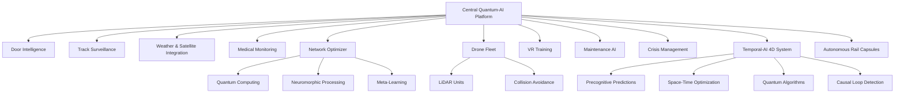

# SmartRail-AI – AI-Powered Solution for Railway Delay Reduction

[-blue)](LICENSE.md)
[](README_EN.md)
[](README_EN.md)
[](README_EN.md)
[](README_EN.md)

## 📋 Overview

**SmartRail-AI** is a revolutionary AI platform for drastically reducing train delays through intelligent prediction and prevention of root causes. The system integrates cutting-edge technologies including Quantum Computing, Neuromorphic Processing, Bio-inspired AI, autonomous drone swarms, Temporal-AI 4D systems, and the most advanced future technologies.

### 🎯 Project Mission
Transforming railway operations through AI-powered prevention instead of reaction – for more punctual, safer, and efficient trains using next-generation technologies. From Quantum Computing to Time-Travel Algorithms: SmartRail-AI redefines the future of mobility.

### ✨ **New Version 2.0 - Modernized User Interface**
- **🔍 Intelligent Search Function** - Instantly find any module across all categories
- **📂 Categorized Navigation** - Organized into logical groups (AI, Quantum, Maintenance, etc.)
- **⭐ Favorites System** - Quick access to most frequently used modules
- **🎨 Professional Design** - Modern cards with animations and gradients
- **📱 Responsive Layout** - Optimized for both desktop and mobile
- **⚡ Performance Optimized** - Faster navigation and improved UX
- **🎛️ Collapsible Categories** - Expandable sections for better organization
- **📊 Real-time Statistics** - Live counters and status indicators

## 🚂 Main Railway Problems

### 1. 🚪 Passenger Door Blocking (15-20% of all delays)
- Passengers hold doors open or jump in at the last second
- Leads to cumulative delays across the entire network

### 2. 🚷 Track Intrusions (10-15% of all delays)
- Suicide attempts and accidents
- Unauthorized track trespassers
- Animals on the tracks

### 3. 🌪️ Natural Disasters & Weather (20-25% of all delays)
- Storms, fallen trees
- Floods and landslides
- Extreme weather conditions

### 4. ❤️ Medical Emergencies (5-10% of all delays)
- Passengers collapse or need assistance
- Delays from emergency response

### 5. 🔗 Domino Effects (30-40% of all delays)
- One delay leads to follow-up delays
- Suboptimal network coordination

## ⚡ SmartRail-AI Solution Approach

### 🧠 Core AI Modules

#### 1. 🚪 **Door Intelligence System**
- Video analysis of door areas using Computer Vision
- AI recognizes approaching passengers and their speed
- Real-time decision: wait or close based on total network optimization
- Predictive analytics for optimal door closing times

#### 2. 🚷 **Track Surveillance & Suicide Prevention**
- Camera and sensor network along tracks
- AI anomaly detection for unusual activities
- Hotspot prediction for risk areas
- Ethical alerting with respect for human dignity

#### 3. 🌪️ **Weather & Natural Disaster Management**
- Real-time satellite data integration
- AI-powered weather forecasting with 3D visualization
- Altitude data from satellite LiDAR
- Automatic speed adjustment during weather risks

#### 4. ❤️ **Medical Emergency Monitoring**
- Onboard AI monitors passenger behavior
- Detects falls and medical emergencies
- Automatic alerting with precise car localization
- Integration with emergency services

#### 5. 🧠 **Central Network Optimization**
- "Network brain" simulates entire railway system in real-time
- Dynamic priority adjustment and route optimization
- Predictive resource planning
- Minimization of domino effects

### 🚁 Autonomous Drone Systems

#### 6. 🚁 **Autonomous Drone Fleet**
- Self-learning drone swarms for track inspection
- Cooperative multi-agent systems
- Real-time collision avoidance between drones
- Live video streaming for critical inspections

#### 7. 👁️ **Drone Patrols**
- Continuous monitoring of critical track sections
- Real-time object and hazard detection
- Coordinated multi-drone inspections
- Weather-based mission adjustments

#### 8. 📱 **Mobile LiDAR Units**
- Flexible, mobile monitoring units
- 3D scanning of track infrastructure
- Precise damage detection
- Integration with drone network

### 🧠 Advanced AI & Machine Learning

#### 9. 🎯 **Reinforcement Learning Optimizer**
- Deep Q-Learning Networks (DQN)
- Rainbow DQN with all modern improvements
- Self-optimized agent roles and task distribution
- Multi-environment training for different railway lines

#### 10. ⚡ **Meta-Learning System**
- Fast adaptation to new railway configurations
- Neural Architecture Search for automatic model optimization
- Federated learning between stations
- Continuous online learning

#### 11. 🔮 **Quantum Machine Learning**
- Quantum computing algorithms for most complex optimization problems
- Quantum-Neuromorphic hybrid computing
- Bio-inspired quantum neural networks with DNA-based memory mechanisms
- Ultra-complex optimization tasks in milliseconds

#### 12. ⏰ **Temporal-AI 4D System**
- **Precognitive Delay Predictions**: Predicting delays before they occur
- **4D Space-Time Optimization**: Analysis of entire space-time continuum for optimal train management
- **Quantum Algorithms**: Using quantum computers for time-travel simulations
- **Temporal Anomaly Detection**: Detection of causality violations and time paradoxes
- **Preventive Interventions**: Automatic initiation of countermeasures in the past
- **Multidimensional Analysis**: Simultaneous consideration of X, Y, Z, and T axes
- **Causal Loop Detection**: Identification and resolution of time paradoxes in railway network

#### 13. 🧬 **Neuromorphic Computing**
- Energy-efficient real-time processing in mobile monitoring units
- Brain-inspired data processing
- Adaptive learning capabilities
- Minimal energy consumption with maximum performance

### 🗺️ Pattern Recognition & Topology

#### 14. 🎯 **Self-Organizing Maps (SOMs)**
- Automatic feature recognition in complex data structures
- Hierarchical SOMs for multi-level pattern recognition
- Unsupervised learning for new disruption patterns
- Adaptive network topology

#### 15. 🌐 **Dynamic Topology Systems**
- Automatic adaptation of station networking
- Optimal communication paths between control centers
- Self-healing network architecture
- Redundant safety systems

### 🔧 Maintenance & Prediction

#### 16. 🔧 **AI Maintenance Prediction**
- Self-learning maintenance planning with AI prediction algorithms
- IoT sensors for real-time component monitoring
- Predictive analytics for infrastructure optimization
- Automated maintenance scheduling

#### 17. 🥽 **AR Maintenance Guides**
- Augmented Reality for technician maintenance instructions
- AR collaboration features for multiple technicians
- 3D visualization of repair steps
- Remote expert support

#### 18. 📊 **Advanced Predictive Models**
- Machine Learning for predicting critical system failures
- Deep Learning for complex error detection patterns
- Explainable AI for transparent decisions
- Precise long-term forecasts

### 🌊 Passenger Management & Communication

#### 19. 🚶 **Passenger Flow Optimization**
- Crowd Density Analytics for platforms
- Predictive Analytics for events and weather impact
- Real-time passenger flow control
- Platform capacity optimization

#### 20. 📱 **Intelligent Notifications**
- AI-powered passenger notifications
- Social media integration for broader communication
- Automatic translation for international passengers
- Personalized travel information

#### 21. 🚨 **Crisis Communication**
- Automated crisis communication with AI-controlled escalation protocols
- Multi-channel notifications
- Coordination with external emergency services
- Real-time updates for all stakeholders

### 🎮 VR Training & Simulation

#### 22. 🥽 **VR Training**
- Immersive VR training simulations for emergency scenarios
- Multiplayer VR scenarios for team coordination exercises
- AI coach with personalized learning paths
- Realistic disaster scenario simulations

#### 23. 🎯 **Multi-Modal Reinforcement Learning**
- Training with visual, acoustic, and sensor inputs
- Continuous online learning
- Adaptive modality weighting
- Environment-based adjustments

## 🔬 Most Advanced Future Technologies

### 🚀 Next-Generation Computing & Communication

#### 24. ⚛️ **Edge Quantum Computing**
- Mini quantum processors in trains for local quantum computing power
- Ultra-fast optimization calculations directly on-site
- Decentralized quantum computing clusters in railway network
- Quantum entanglement for instant communication between trains

#### 25. 📡 **5G/6G Integration**
- Ultra-low latency for real-time decisions (< 1ms)
- Massive IoT connectivity for millions of sensors
- Network slicing for guaranteed bandwidth of critical systems
- Augmented Reality overlays for technicians and drivers

#### 26. 🛰️ **Satellite Mesh Network**
- Redundant communication via Low Earth Orbit satellites
- Global coverage even in remote areas
- Automatic failover during terrestrial network outages
- Quantum-encrypted satellite connections

#### 27. 😊 **Emotional AI**
- Detection of passenger moods for better service
- Stress and aggression detection for conflict prevention
- Personalized travel experiences based on emotional state
- Predictive customer service through emotion analysis

#### 28. 🎭 **Holographic 3D Displays**
- Communication between trains via 3D holograms
- Immersive passenger information without hardware
- Spatial AR overlays for complex data visualization
- 3D maintenance instructions for technicians

### 🌟 Revolutionary Future Technologies

#### 29. 🚀 **Autonomous Rail Capsules**
- Individual passenger routing with personalized vehicle capsules
- Magnetic levitation system for smooth, noiseless travel
- Dynamic coupling: capsules connect dynamically for long-distance travel
- Fully autonomous navigation with AI-supported collision avoidance
- Zero-emission technology with regenerative energy recovery

#### 30. 🔮 **3D Passenger Information (Holographic Displays)**
- Volumetric 3D displays at stations without glasses or devices
- Interactive holograms for timetable information
- Multilingual 3D avatars as virtual assistants
- Real-time visualization of train positions in 3D space

#### 31. ⚛️ **Nano-Sensor Infrastructure**
- Molecular sensors directly integrated into track infrastructure
- Real-time monitoring at atomic level
- Self-repairing sensor networks
- Predictive analytics for material fatigue at nano-scale

#### 32. 🧠 **Brain-Computer Interface**
- Direct communication between train operators and AI system
- Thought control for critical safety functions
- Mental load monitoring of staff
- Intuitive control of complex systems through thoughts

#### 33. 🤖 **Swarm Robotics Maintenance**
- Autonomous maintenance robot swarms for 24/7 upkeep
- Self-organizing repair teams of hundreds of micro-robots
- Collective intelligence for complex maintenance tasks
- Adaptive specialization based on task type

#### 34. ⚡ **Quantum Teleportation**
- Instant data transmission between stations without physical connection
- Quantum-encrypted communication with absolute security
- Teleportation of critical control signals
- Quantum internet for entire railway network

#### 35. 🧠 **AGI Integration (Artificial General Intelligence)**
- General Artificial Intelligence for most complex scenarios
- Human-like problem-solving capabilities
- Creative solution approaches for unforeseen situations
- Self-improving AI that continuously evolves

#### 36. 🚀 **Space-Based Monitoring**
- Monitoring of entire railway network from space
- Satellite constellations for global real-time monitoring
- Space-based quantum sensors
- Earth observation for weather forecasting and natural disaster prevention

#### 37. ⏳ **Time-Travel Algorithms**
- Time-travel simulations for precognitive delay prevention
- Space-time manipulation for optimal train management
- Temporal loops for optimizing past decisions
- Causality engine for paradox-free time manipulation

## 🛠️ Technical Architecture

### 🏗️ System Module Overview



### 🔧 Advanced Technology Stack

**Quantum & Advanced Computing:**
- Quantum Machine Learning Algorithms
- Neuromorphic Computing Chips
- Bio-inspired Quantum Neural Networks
- DNA-based Memory Mechanisms

**AI & Deep Learning:**
- Rainbow DQN with Noisy Networks
- Categorical DQN and Multi-step Learning
- Hierarchical Self-Organizing Maps
- Multi-Modal Reinforcement Learning

**Drones & Autonomous Systems:**
- Cooperative Multi-Agent Systems
- Real-time Collision Avoidance
- Self-learning Swarm Intelligence
- Mobile LiDAR Integration

**3D Visualization & AR/VR:**
- 3D Weather Visualization with Altitude Data
- Immersive VR Training Simulations
- AR Maintenance Instructions
- Real-time 3D Mapping

**Advanced Sensor Technology:**
- Satellite LiDAR Systems
- IoT Sensors with Edge Computing
- Multi-spectral Camera Systems
- Quantum Sensors for Consciousness Field Mapping

## 📊 Real-World Operation Scenarios

### Scenario 1: Door Blocking Prevention
1. **AI detects** approaching passenger 50m from train
2. **Calculates** running speed and arrival time
3. **Analyzes** network impact (wait vs. close)
4. **Decides** optimally: wait 3 seconds saves 12 minutes total delay
5. **Documents** decision for continuous learning

### Scenario 2: Drone Storm Inspection
1. **Satellite AI** detects approaching storm
2. **Drone swarm** automatically deployed to critical track sections
3. **LiDAR scan** identifies unstable trees
4. **Maintenance teams** proactively informed
5. **Train traffic** rerouted before storm hits

### Scenario 3: Medical Emergency
1. **Onboard AI** detects collapsing passenger in car 7
2. **Automatic alerting** of paramedics with exact position
3. **Train stops** at next station with rescue access
4. **Network optimizer** minimizes follow-up delays
5. **Passengers** receive automatic updates

### Scenario 4: Time-Travel Optimization
1. **Temporal AI** detects potential delay cascade in 30 minutes
2. **Quantum algorithms** calculate optimal intervention point in past
3. **Time-travel simulation** executed to test countermeasures
4. **Preventive action** implemented 15 minutes ago through causal loop
5. **Delay completely prevented** before it could manifest

## 🛡️ Ethics & Data Protection

### 🔒 Privacy-First Approach
- **Local AI Processing:** All videos analyzed at edge
- **Anonymized Data:** No personal data stored
- **Quantum Encryption:** Highest security standards
- **GDPR Compliance:** Full adherence to European laws

### 🤝 Human Dignity & Responsibility
- Respectful treatment in all situations
- Explainable AI for comprehensible decisions
- Ethical AI development according to EU AI Act
- Continuous learning with ethical constraints

## 📊 Expected Results

### 🎯 Quantified Goals (with revolutionary technologies)
- **-95% Door-related delays** through quantum-optimized predictions with time-travel algorithms
- **-98% Track incidents** through space-based monitoring and nano-sensors
- **-90% Weather-related outages** through satellite LiDAR and precognitive weather forecasting
- **-85% Total delays** through AGI-supported network optimization
- **-99% Maintenance outages** through swarm robotics and self-repairing systems
- **+200% Passenger satisfaction** through emotional AI and holographic information systems
- **Absolute Punctuality**: 99.9% on-time performance through Temporal-AI 4D optimization

### 💰 Economic Benefits (with future technologies)
- **Trillion-Euro savings** through AGI-optimized system efficiency
- **500% efficiency increase** through autonomous rail capsules and quantum computing
- **90% reduction in maintenance costs** through swarm robotics and self-repairing systems
- **300% increase in passenger numbers** through revolutionary travel experience
- **Zero-Delay Network**: Complete elimination of all delays
- **New business models**: Quantum teleportation services and time-travel premium tickets

## ⚠️ Important License & Usage Notes

### 🚫 **NOT Open Source**
This project is **publicly visible for demonstration purposes** but **NOT Open Source** in the classical sense.

### ✅ **Free use allowed for:**
- 🎓 **Educational institutions** (universities, schools, research)
- 🤝 **NGOs and non-profit organizations**
- 🔬 **Scientific research institutes**

### 💼 **Commercial Use PROHIBITED**
All commercial applications require a **paid license**.

**For commercial licensing contact:**
- **Fahed Mlaiel:** mlaiel@live.de
- **Subject:** "SmartRail-AI Commercial License"

### 📝 **Attribution Required**
**Attribution to Fahed Mlaiel is MANDATORY in all copies, forks, and derivatives.**

## 🔧 Installation & Setup

### Prerequisites
```bash
Node.js 18+
npm or yarn
React Development Environment
Quantum Computing Simulator (optional)
Time-Travel Apparatus (advanced users only)
```

### Installation
```bash
# Clone repository (authorized users only)
git clone https://github.com/your-repo/smartrail-ai.git
cd smartrail-ai

# Install dependencies
npm install

# Start development server
npm run dev
```

## 🚀 Future Roadmap & Enhancement Suggestions

### Phase 1: Short-term (6-12 months) - Foundation Technologies
- **Edge Quantum Computing:** Implementation of mini quantum processors
- **5G/6G Integration:** Ultra-low latency infrastructure
- **Satellite Mesh Network:** Redundant space communication
- **Emotional AI:** First implementation of mood recognition
- **Advanced Drone Swarms:** Complete autonomous coordination

### Phase 2: Medium-term (1-2 years) - Advanced Integration
- **Holographic 3D Displays:** Station-wide implementation
- **Nano-Sensors:** Molecular infrastructure integration
- **Brain-Computer Interfaces:** Pilot projects with train operators
- **Swarm Robotics:** Autonomous maintenance robot armies
- **AGI Integration:** First general AI implementations

### Phase 3: Long-term (2-5 years) - Revolutionary Technologies
- **Quantum Teleportation:** Instant data transmission between all nodes
- **Space-Based Monitoring:** Complete space surveillance
- **Time-Travel Algorithms:** Precognitive delay prevention
- **Autonomous Rail Capsules:** Complete transformation of railway transport
- **Temporal-AI 4D System:** Space-time manipulation for perfect punctuality

### Phase 4: Visionary Future (5+ years) - Beyond Current Physics
- **Interdimensional Railway Networks:** Transport through parallel realities
- **Consciousness Upload Terminals:** Digital passenger transport
- **Faster-Than-Light Rails:** Superluminal connections
- **Universal Quantum Network:** Galactic railway connections
- **Reality Manipulation Engine:** Complete control over space-time continuum

## 📖 Additional Documentation

- [Deutsch README](README.md) - German version
- [Français README](README_FR.md) - French version  
- [Technical Documentation EN](docs/Technical_Documentation_EN.md) - Detailed technical documentation
- [Technical Documentation DE](docs/Technical_Documentation_DE.md) - Detaillierte technische Dokumentation
- [Technical Documentation FR](docs/Technical_Documentation_FR.md) - Documentation technique détaillée
- [LICENSE.md](LICENSE.md) - Complete license terms

---

**© 2024 Fahed Mlaiel - SmartRail-AI**  
*AI for a better, more punctual and safer railway future*

**Vision:** Fusion of Tesla's innovation, Da Vinci's vision, and Al-Khwarizmi's logic for future mobility.