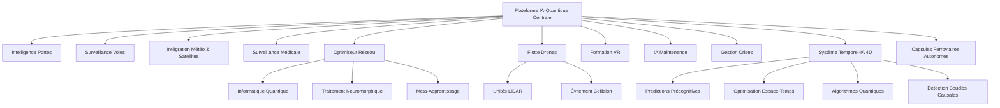

# SmartRail-AI – Solution IA pour la Réduction des Retards Ferroviaires

[-blue)](LICENSE.md)
[](README_FR.md)
[](README_FR.md)
[](README_FR.md)
[](README_FR.md)

## 📋 Aperçu

**SmartRail-AI** est une plateforme IA révolutionnaire pour réduire drastiquement les retards de trains grâce à la prédiction et prévention intelligente des causes principales. Le système intègre des technologies de pointe incluant l'informatique quantique, le traitement neuromorphique, l'IA bio-inspirée, les essaims de drones autonomes, les systèmes temporels-IA 4D et les technologies futures les plus avancées.

### 🎯 Mission du Projet
Transformer les opérations ferroviaires par la prévention alimentée par l'IA au lieu de la réaction – pour des trains plus ponctuels, plus sûrs et plus efficaces utilisant des technologies de nouvelle génération. De l'informatique quantique aux algorithmes de voyage dans le temps : SmartRail-AI redéfinit l'avenir de la mobilité.

### ✨ **Nouvelle Version 2.0 - Interface Utilisateur Modernisée**
- **🔍 Fonction de Recherche Intelligente** - Trouvez instantanément n'importe quel module
- **📂 Navigation Catégorisée** - Organisée en groupes logiques (IA, Quantum, Maintenance, etc.)
- **⭐ Système de Favoris** - Accès rapide aux modules les plus utilisés
- **🎨 Design Professionnel** - Cartes modernes avec animations et dégradés
- **📱 Layout Responsive** - Optimisé pour desktop et mobile
- **⚡ Performance Optimisée** - Navigation plus rapide et UX améliorée
- **🎛️ Catégories Pliables** - Sections extensibles pour une meilleure organisation
- **📊 Statistiques Temps Réel** - Compteurs en direct et indicateurs de statut

## 🚂 Principaux Problèmes Ferroviaires

### 1. 🚪 Blocage des Portes par les Passagers (15-20% de tous les retards)
- Les passagers maintiennent les portes ouvertes ou sautent au dernier moment
- Conduit à des retards cumulatifs sur tout le réseau

### 2. 🚷 Intrusions sur les Voies (10-15% de tous les retards)
- Tentatives de suicide et accidents
- Intrus non autorisés sur les voies
- Animaux sur les rails

### 3. 🌪️ Catastrophes Naturelles & Météo (20-25% de tous les retards)
- Tempêtes, arbres tombés
- Inondations et glissements de terrain
- Conditions météorologiques extrêmes

### 4. ❤️ Urgences Médicales (5-10% de tous les retards)
- Passagers qui s'effondrent ou ont besoin d'assistance
- Retards dus aux interventions d'urgence

### 5. 🔗 Effets Domino (30-40% de tous les retards)
- Un retard entraîne des retards successifs
- Coordination réseau sous-optimale

## ⚡ Approche Solution SmartRail-AI

### 🧠 Modules IA Principaux

#### 1. 🚪 **Système d'Intelligence des Portes**
- Analyse vidéo des zones de portes utilisant la vision par ordinateur
- L'IA reconnaît les passagers qui approchent et leur vitesse
- Décision en temps réel : attendre ou fermer basé sur l'optimisation totale du réseau
- Analyses prédictives pour des temps de fermeture de portes optimaux

#### 2. 🚷 **Surveillance des Voies & Prévention du Suicide**
- Réseau de caméras et capteurs le long des voies
- Détection d'anomalies IA pour activités inhabituelles
- Prédiction de points chauds pour zones à risque
- Alerte éthique avec respect pour la dignité humaine

#### 3. 🌪️ **Gestion Météo & Catastrophes Naturelles**
- Intégration de données satellites en temps réel
- Prévisions météo alimentées par IA avec visualisation 3D
- Données d'altitude du LiDAR satellite
- Ajustement automatique de vitesse pendant les risques météo

#### 4. ❤️ **Surveillance des Urgences Médicales**
- IA embarquée surveillant le comportement des passagers
- Détecte les chutes et urgences médicales
- Alerte automatique avec localisation précise du wagon
- Intégration avec les services d'urgence

#### 5. 🧠 **Optimisation Centrale du Réseau**
- "Cerveau réseau" simule tout le système ferroviaire en temps réel
- Ajustement dynamique des priorités et optimisation des routes
- Planification prédictive des ressources
- Minimisation des effets domino

### 🚁 Systèmes de Drones Autonomes

#### 6. 🚁 **Flotte de Drones Autonomes**
- Essaims de drones auto-apprenants pour inspection des voies
- Systèmes multi-agents coopératifs
- Évitement de collision en temps réel entre drones
- Streaming vidéo en direct pour inspections critiques

#### 7. 👁️ **Patrouilles de Drones**
- Surveillance continue des sections de voies critiques
- Détection d'objets et dangers en temps réel
- Inspections multi-drones coordonnées
- Ajustements de mission basés sur la météo

#### 8. 📱 **Unités LiDAR Mobiles**
- Unités de surveillance flexibles et mobiles
- Scan 3D de l'infrastructure des voies
- Détection précise des dommages
- Intégration avec le réseau de drones

### 🧠 IA Avancée & Apprentissage Automatique

#### 9. 🎯 **Optimiseur d'Apprentissage par Renforcement**
- Réseaux d'Apprentissage Q Profond (DQN)
- Rainbow DQN avec toutes les améliorations modernes
- Rôles d'agents auto-optimisés et distribution des tâches
- Entraînement multi-environnement pour différentes lignes ferroviaires

#### 10. ⚡ **Système de Méta-Apprentissage**
- Adaptation rapide aux nouvelles configurations ferroviaires
- Recherche d'Architecture Neurale pour optimisation automatique de modèles
- Apprentissage fédéré entre stations
- Apprentissage en ligne continu

#### 11. 🔮 **Apprentissage Automatique Quantique**
- Algorithmes informatiques quantiques pour problèmes d'optimisation les plus complexes
- Informatique hybride Quantique-Neuromorphique
- Réseaux neuronaux quantiques bio-inspirés avec mécanismes de mémoire basés sur l'ADN
- Tâches d'optimisation ultra-complexes en millisecondes

#### 12. ⏰ **Système Temporel-IA 4D**
- **Prédictions de Retards Précognitives** : Prédire les retards avant qu'ils n'arrivent
- **Optimisation Espace-Temps 4D** : Analyse de tout le continuum espace-temps pour gestion optimale des trains
- **Algorithmes Quantiques** : Utilisation d'ordinateurs quantiques pour simulations de voyage dans le temps
- **Détection d'Anomalies Temporelles** : Détection de violations de causalité et paradoxes temporels
- **Interventions Préventives** : Initiation automatique de contre-mesures dans le passé
- **Analyse Multidimensionnelle** : Considération simultanée des axes X, Y, Z et T
- **Détection de Boucles Causales** : Identification et résolution de paradoxes temporels dans le réseau ferroviaire

#### 13. 🧬 **Informatique Neuromorphique**
- Traitement temps réel économe en énergie dans unités de surveillance mobiles
- Traitement de données inspiré du cerveau
- Capacités d'apprentissage adaptatif
- Consommation d'énergie minimale avec performance maximale

### 🗺️ Reconnaissance de Motifs & Topologie

#### 14. 🎯 **Cartes Auto-Organisatrices (SOMs)**
- Reconnaissance automatique de caractéristiques dans structures de données complexes
- SOMs hiérarchiques pour reconnaissance de motifs multi-niveaux
- Apprentissage non supervisé pour nouveaux motifs de perturbation
- Topologie réseau adaptative

#### 15. 🌐 **Systèmes de Topologie Dynamique**
- Adaptation automatique de la mise en réseau des stations
- Chemins de communication optimaux entre centres de contrôle
- Architecture réseau auto-réparatrice
- Systèmes de sécurité redondants

### 🔧 Maintenance & Prédiction

#### 16. 🔧 **Prédiction de Maintenance IA**
- Planification de maintenance auto-apprenante avec algorithmes de prédiction IA
- Capteurs IoT pour surveillance en temps réel des composants
- Analyses prédictives pour optimisation d'infrastructure
- Planification automatisée de la maintenance

#### 17. 🥽 **Guides de Maintenance AR**
- Réalité Augmentée pour instructions de maintenance des techniciens
- Fonctionnalités de collaboration AR pour plusieurs techniciens
- Visualisation 3D des étapes de réparation
- Support expert à distance

#### 18. 📊 **Modèles Prédictifs Avancés**
- Apprentissage Automatique pour prédire défaillances système critiques
- Apprentissage Profond pour motifs de détection d'erreurs complexes
- IA Explicable pour décisions transparentes
- Prévisions précises à long terme

### 🌊 Gestion des Passagers & Communication

#### 19. 🚶 **Optimisation du Flux de Passagers**
- Analyses de Densité de Foule pour quais
- Analyses Prédictives pour événements et impact météo
- Contrôle du flux de passagers en temps réel
- Optimisation de la capacité des quais

#### 20. 📱 **Notifications Intelligentes**
- Notifications passagers alimentées par IA
- Intégration médias sociaux pour communication plus large
- Traduction automatique pour passagers internationaux
- Informations de voyage personnalisées

#### 21. 🚨 **Communication de Crise**
- Communication de crise automatisée avec protocoles d'escalade contrôlés par IA
- Notifications multi-canaux
- Coordination avec services d'urgence externes
- Mises à jour temps réel pour toutes les parties prenantes

### 🎮 Formation VR & Simulation

#### 22. 🥽 **Formation VR**
- Simulations de formation VR immersives pour scénarios d'urgence
- Scénarios VR multijoueurs pour exercices de coordination d'équipe
- Coach IA avec parcours d'apprentissage personnalisés
- Simulations réalistes de scénarios de catastrophe

#### 23. 🎯 **Apprentissage par Renforcement Multi-Modal**
- Formation avec entrées visuelles, acoustiques et de capteurs
- Apprentissage en ligne continu
- Pondération adaptative de modalité
- Ajustements basés sur l'environnement

## 🔬 Technologies Futures les Plus Avancées

### 🚀 Informatique & Communication Nouvelle Génération

#### 24. ⚛️ **Informatique Quantique Edge**
- Mini processeurs quantiques dans les trains pour puissance informatique quantique locale
- Calculs d'optimisation ultra-rapides directement sur site
- Clusters informatiques quantiques décentralisés dans le réseau ferroviaire
- Intrication quantique pour communication instantanée entre trains

#### 25. 📡 **Intégration 5G/6G**
- Latence ultra-faible pour décisions temps réel (< 1ms)
- Connectivité IoT massive pour millions de capteurs
- Découpage réseau pour bande passante garantie des systèmes critiques
- Superpositions Réalité Augmentée pour techniciens et conducteurs

#### 26. 🛰️ **Réseau Maillé Satellite**
- Communication redondante via satellites orbite terrestre basse
- Couverture globale même dans zones reculées
- Basculement automatique lors de pannes réseau terrestres
- Connexions satellites chiffrées quantiquement

#### 27. 😊 **IA Émotionnelle**
- Détection des humeurs passagers pour meilleur service
- Détection stress et agression pour prévention conflits
- Expériences voyage personnalisées basées sur état émotionnel
- Service client prédictif par analyse émotions

#### 28. 🎭 **Affichages Holographiques 3D**
- Communication entre trains via hologrammes 3D
- Informations passagers immersives sans matériel
- Superpositions AR spatiales pour visualisation données complexes
- Instructions maintenance 3D pour techniciens

### 🌟 Technologies Révolutionnaires du Futur

#### 29. 🚀 **Capsules Ferroviaires Autonomes**
- Routage passagers individuel avec capsules véhicules personnalisées
- Système lévitation magnétique pour voyage fluide et silencieux
- Couplage dynamique : capsules se connectent dynamiquement pour voyages longue distance
- Navigation entièrement autonome avec évitement collision assisté IA
- Technologie zéro émission avec récupération énergie régénérative

#### 30. 🔮 **Informations Passagers 3D (Affichages Holographiques)**
- Affichages 3D volumétriques dans gares sans lunettes ni appareils
- Hologrammes interactifs pour informations horaires
- Avatars 3D multilingues comme assistants virtuels
- Visualisation temps réel positions trains dans espace 3D

#### 31. ⚛️ **Infrastructure Nano-Capteurs**
- Capteurs moléculaires directement intégrés dans infrastructure voies
- Surveillance temps réel au niveau atomique
- Réseaux capteurs auto-réparants
- Analyses prédictives pour fatigue matériaux à l'échelle nano

#### 32. 🧠 **Interface Cerveau-Ordinateur**
- Communication directe entre opérateurs trains et système IA
- Contrôle par pensée pour fonctions sécurité critiques
- Surveillance charge mentale du personnel
- Contrôle intuitif systèmes complexes par pensées

#### 33. 🤖 **Maintenance Robotique en Essaim**
- Essaims robots maintenance autonomes pour entretien 24/7
- Équipes réparation auto-organisatrices de centaines micro-robots
- Intelligence collective pour tâches maintenance complexes
- Spécialisation adaptative selon type tâche

#### 34. ⚡ **Téléportation Quantique**
- Transmission données instantanée entre gares sans connexion physique
- Communication chiffrée quantiquement avec sécurité absolue
- Téléportation signaux contrôle critiques
- Internet quantique pour tout réseau ferroviaire

#### 35. 🧠 **Intégration AGI (Intelligence Artificielle Générale)**
- Intelligence Artificielle générale pour scénarios les plus complexes
- Capacités résolution problèmes semblables humaines
- Approches solutions créatives pour situations imprévues
- IA auto-améliorante qui évolue continuellement

#### 36. 🚀 **Surveillance Spatiale**
- Surveillance tout réseau ferroviaire depuis l'espace
- Constellations satellites pour surveillance temps réel globale
- Capteurs quantiques spatiaux
- Observation Terre pour prévisions météo et prévention catastrophes naturelles

#### 37. ⏳ **Algorithmes Voyage Temporel**
- Simulations voyage temps pour prévention retards précognitive
- Manipulation espace-temps pour gestion optimale trains
- Boucles temporelles pour optimiser décisions passées
- Moteur causalité pour manipulation temps sans paradoxe

## 🛠️ Architecture Technique

### 🏗️ Aperçu Modules Système



### 🔧 Stack Technologique Avancé

**Informatique Quantique & Avancée :**
- Algorithmes Apprentissage Automatique Quantique
- Puces Informatique Neuromorphique
- Réseaux Neuronaux Quantiques Bio-inspirés
- Mécanismes Mémoire basés ADN

**IA & Apprentissage Profond :**
- Rainbow DQN avec Réseaux Bruités
- DQN Catégorique et Apprentissage Multi-étapes
- Cartes Auto-Organisatrices Hiérarchiques
- Apprentissage par Renforcement Multi-Modal

**Drones & Systèmes Autonomes :**
- Systèmes Multi-Agents Coopératifs
- Évitement Collision Temps Réel
- Intelligence Essaim Auto-apprenante
- Intégration LiDAR Mobile

**Visualisation 3D & AR/VR :**
- Visualisation Météo 3D avec Données Altitude
- Simulations Formation VR Immersives
- Instructions Maintenance AR
- Cartographie 3D Temps Réel

**Technologie Capteurs Avancée :**
- Systèmes LiDAR Satellite
- Capteurs IoT avec Informatique Edge
- Systèmes Caméras Multi-spectrales
- Capteurs Quantiques pour Cartographie Champs Conscience

## 📊 Scénarios d'Opération Monde Réel

### Scénario 1 : Prévention Blocage Portes
1. **IA détecte** passager approchant à 50m du train
2. **Calcule** vitesse course et temps arrivée
3. **Analyse** impact réseau (attendre vs fermer)
4. **Décide** optimalement : attendre 3 secondes économise 12 minutes retard total
5. **Documente** décision pour apprentissage continu

### Scénario 2 : Inspection Tempête Drones
1. **IA satellite** détecte tempête approchante
2. **Essaim drones** déployé automatiquement vers sections voies critiques
3. **Scan LiDAR** identifie arbres instables
4. **Équipes maintenance** informées préventivement
5. **Trafic trains** redirigé avant frappe tempête

### Scénario 3 : Urgence Médicale
1. **IA embarquée** détecte passager s'effondrant dans wagon 7
2. **Alerte automatique** des secours avec position exacte
3. **Train s'arrête** à prochaine gare avec accès secours
4. **Optimiseur réseau** minimise retards consécutifs
5. **Passagers** reçoivent mises à jour automatiques

### Scénario 4 : Optimisation Voyage Temporel
1. **IA temporelle** détecte cascade retards potentielle dans 30 minutes
2. **Algorithmes quantiques** calculent point intervention optimal dans passé
3. **Simulation voyage temps** exécutée pour tester contre-mesures
4. **Action préventive** implémentée il y a 15 minutes via boucle causale
5. **Retard complètement prévenu** avant qu'il puisse se manifester

## 🛡️ Éthique & Protection Données

### 🔒 Approche Privacy-First
- **Traitement IA Local :** Toutes vidéos analysées en périphérie
- **Données Anonymisées :** Aucune donnée personnelle stockée
- **Chiffrement Quantique :** Standards sécurité les plus élevés
- **Conformité RGPD :** Adhésion complète aux lois européennes

### 🤝 Dignité Humaine & Responsabilité
- Traitement respectueux dans toutes situations
- IA explicable pour décisions compréhensibles
- Développement IA éthique selon EU AI Act
- Apprentissage continu avec contraintes éthiques

## 📊 Résultats Attendus

### 🎯 Objectifs Quantifiés (avec technologies révolutionnaires)
- **-95% retards liés portes** par prédictions optimisées quantiquement avec algorithmes voyage temps
- **-98% incidents voies** par surveillance spatiale et nano-capteurs
- **-90% pannes liées météo** par LiDAR satellite et prévisions météo précognitives
- **-85% retards totaux** par optimisation réseau assistée AGI
- **-99% pannes maintenance** par robotique essaim et systèmes auto-réparants
- **+200% satisfaction passagers** par IA émotionnelle et systèmes information holographiques
- **Ponctualité Absolue** : 99.9% performance à l'heure par optimisation Temporelle-IA 4D

### 💰 Bénéfices Économiques (avec technologies futures)
- **Économies billions euros** par efficacité système optimisée AGI
- **500% augmentation efficacité** par capsules ferroviaires autonomes et informatique quantique
- **90% réduction coûts maintenance** par robotique essaim et systèmes auto-réparants
- **300% augmentation nombres passagers** par expérience voyage révolutionnaire
- **Réseau Zéro-Retard** : Élimination complète de tous retards
- **Nouveaux modèles affaires** : Services téléportation quantique et billets premium voyage temps

## ⚠️ Notes Importantes Licence & Usage

### 🚫 **PAS Open Source**
Ce projet est **publiquement visible à des fins de démonstration** mais **PAS Open Source** au sens classique.

### ✅ **Usage gratuit autorisé pour :**
- 🎓 **Institutions éducatives** (universités, écoles, recherche)
- 🤝 **ONG et organisations à but non lucratif**
- 🔬 **Instituts recherche scientifique**

### 💼 **Usage Commercial INTERDIT**
Toutes applications commerciales nécessitent une **licence payante**.

**Pour licence commerciale contacter :**
- **Fahed Mlaiel :** mlaiel@live.de
- **Sujet :** "Licence Commerciale SmartRail-AI"

### 📝 **Attribution Obligatoire**
**Attribution à Fahed Mlaiel est OBLIGATOIRE dans toutes copies, forks et dérivés.**

## 🔧 Installation & Configuration

### Prérequis
```bash
Node.js 18+
npm ou yarn
Environnement Développement React
Simulateur Informatique Quantique (optionnel)
Appareil Voyage Temporel (utilisateurs avancés uniquement)
```

### Installation
```bash
# Cloner dépôt (utilisateurs autorisés uniquement)
git clone https://github.com/your-repo/smartrail-ai.git
cd smartrail-ai

# Installer dépendances
npm install

# Démarrer serveur développement
npm run dev
```

## 🚀 Feuille Route Future & Suggestions Amélioration

### Phase 1 : Court terme (6-12 mois) - Technologies Fondation
- **Informatique Quantique Edge :** Implémentation mini processeurs quantiques
- **Intégration 5G/6G :** Infrastructure latence ultra-faible
- **Réseau Maillé Satellite :** Communication espace redondante
- **IA Émotionnelle :** Première implémentation reconnaissance humeur
- **Essaims Drones Avancés :** Coordination autonome complète

### Phase 2 : Moyen terme (1-2 ans) - Intégration Avancée
- **Affichages Holographiques 3D :** Implémentation gares
- **Nano-Capteurs :** Intégration infrastructure moléculaire
- **Interfaces Cerveau-Ordinateur :** Projets pilotes avec opérateurs trains
- **Robotique Essaim :** Armées robots maintenance autonomes
- **Intégration AGI :** Premières implémentations IA générale

### Phase 3 : Long terme (2-5 ans) - Technologies Révolutionnaires
- **Téléportation Quantique :** Transmission données instantanée entre tous nœuds
- **Surveillance Spatiale :** Surveillance espace complète
- **Algorithmes Voyage Temps :** Prévention retards précognitive
- **Capsules Ferroviaires Autonomes :** Transformation complète transport ferroviaire
- **Système Temporel-IA 4D :** Manipulation espace-temps pour ponctualité parfaite

### Phase 4 : Futur Visionnaire (5+ ans) - Au-delà Physique Actuelle
- **Réseaux Ferroviaires Interdimensionnels :** Transport par réalités parallèles
- **Terminaux Upload Conscience :** Transport passagers numérique
- **Rails Plus-Rapides-Que-Lumière :** Connexions superluminales
- **Réseau Quantique Universel :** Connexions ferroviaires galactiques
- **Moteur Manipulation Réalité :** Contrôle complet continuum espace-temps

## 📖 Documentation Supplémentaire

- [README Deutsch](README.md) - Version allemande
- [README English](README_EN.md) - Version anglaise  
- [Documentation Technique FR](docs/Technical_Documentation_FR.md) - Documentation technique détaillée
- [Documentation Technique DE](docs/Technical_Documentation_DE.md) - Detaillierte technische Dokumentation
- [Documentation Technique EN](docs/Technical_Documentation_EN.md) - Detailed technical documentation
- [LICENSE.md](LICENSE.md) - Termes licence complets

---

**© 2024 Fahed Mlaiel - SmartRail-AI**  
*IA pour un avenir ferroviaire meilleur, plus ponctuel et plus sûr*

**Vision :** Fusion de l'innovation de Tesla, la vision de Da Vinci et la logique d'Al-Khwarizmi pour la mobilité future.