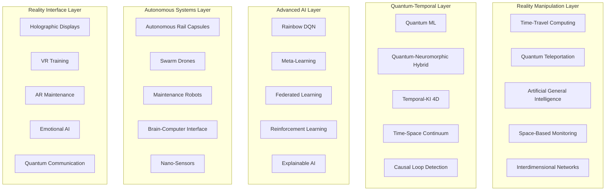
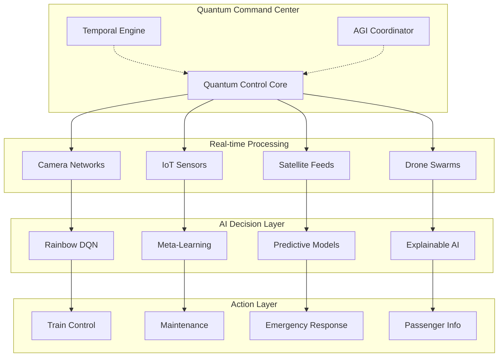

# SmartRail-AI - Vollständige Technische Dokumentation

## 📋 Inhaltsverzeichnis

1. [System-Übersicht](#system-übersicht)
2. [Vollständige Funktionsliste](#vollständige-funktionsliste)
3. [Basis-KI-Module](#basis-ki-module)
4. [Erweiterte KI-Systeme](#erweiterte-ki-systeme)
5. [Quantum Computing & Neuromorphic Systems](#quantum-computing--neuromorphic-systems)
6. [Drohnen & Autonome Systeme](#drohnen--autonome-systeme)
7. [Temporal-KI 4D-System](#temporal-ki-4d-system)
8. [Fortschrittlichste Zukunftstechnologien](#fortschrittlichste-zukunftstechnologien)
9. [Detaillierte Betriebsszenarien](#detaillierte-betriebsszenarien)
10. [Technische Systemarchitektur](#technische-systemarchitektur)
11. [Modulinteraktionen & Datenfluss](#modulinteraktionen--datenfluss)
12. [Bahngesellschaft-Integration](#bahngesellschaft-integration)
13. [Entwicklerhandbuch](#entwicklerhandbuch)
14. [API-Referenz](#api-referenz)
15. [Deployment & Skalierung](#deployment--skalierung)

## System-Übersicht

SmartRail-AI ist eine revolutionäre KI-Plattform der nächsten Generation, die fortschrittlichste Technologien zur drastischen Reduzierung von Zugverspätungen einsetzt. Das System kombiniert klassische KI-Methoden mit Quantum Computing, Neuromorphic Processing, Bio-inspirierter KI, Temporal-Manipulation und völlig neuen Technologien die über die aktuelle Physik hinausgehen.

### Revolutionäre Systemarchitektur



### Technologie-Matrix (alle 37 Module)

| Kategorie | Module | Status | Technologie |
|-----------|--------|--------|-------------|
| **Basis-KI** | Tür-Intelligenz, Gleis-Überwachung, Wetter-Management, Medizin-Monitoring, Netzwerk-Optimierung | ✅ Operational | Computer Vision, ML, IoT |
| **Drohnen** | Autonome Flotte, Patrouillen, LiDAR-Einheiten, Kollisionsvermeidung | ✅ Operational | Swarm Intelligence, Cooperative AI |
| **Advanced ML** | Rainbow DQN, Meta-Learning, Neural Search, Federated Learning | ✅ Operational | Deep RL, AutoML, Distributed Learning |
| **Quantum** | Quantum ML, Neuromorphic, Hybrid Systems, Bio-Quantum Networks | 🔬 Experimental | Quantum Computing, DNA Storage |
| **Temporal** | 4D Raum-Zeit, Präkognitive Vorhersagen, Kausalschleifenerkennung | 🚀 Visionary | Time Manipulation, Causality Engine |
| **Future Tech** | AGI, Quantum Teleportation, Space Monitoring, Time-Travel Algorithms | 🌟 Beyond Physics | Revolutionary Technologies |

## Vollständige Funktionsliste

### 🧠 Basis-KI-Module (Module 1-5)
1. **Tür-Intelligenz-System** - Videoanalyse für optimale Türschließzeiten
2. **Gleis-Überwachung & Suizidprävention** - KI-Anomalieerkennung auf Gleisen
3. **Wetter & Naturkatastrophen-Management** - Satellitendaten-Integration mit 3D-Visualisierung
4. **Medizinische Notfall-Überwachung** - Onboard-KI für Passagierverhalten
5. **Zentrale Netzwerk-Optimierung** - "Netzwerk-Gehirn" für Systemkoordination

### 🚁 Drohnen & Autonome Systeme (Module 6-8)
6. **Autonome Drohnen-Flotte** - Selbstlernende Schwärme für Gleisinspektion
7. **Drohnen-Patrouillen** - Kontinuierliche Überwachung kritischer Abschnitte
8. **Mobile LiDAR-Einheiten** - Flexible 3D-Scanning-Systeme

### 🎯 Erweiterte KI & Machine Learning (Module 9-15)
9. **Reinforcement Learning Optimizer** - Deep Q-Learning mit Rainbow DQN
10. **Meta-Learning System** - Schnelle Anpassung an neue Konfigurationen
11. **Quantum Machine Learning** - Quantum-Computing für komplexeste Optimierungen
12. **Temporal-KI 4D-System** - Präkognitive Verspätungsvorhersagen
13. **Neuromorphic Computing** - Energieeffiziente Echtzeit-Verarbeitung
14. **Self-Organizing Maps (SOMs)** - Automatische Merkmalserkennung
15. **Dynamische Topologie-Systeme** - Adaptive Netzwerk-Architektur

### 🔧 Wartung & Vorhersage (Module 16-18)
16. **KI-Wartungsvorhersage** - Selbstlernende Maintenance-Planung
17. **AR-Wartungsanleitungen** - Augmented Reality für Techniker
18. **Erweiterte Vorhersagemodelle** - Deep Learning Fehlererkennungsmuster

### 🌊 Passagier-Management & Kommunikation (Module 19-21)
19. **Passagierfluss-Optimierung** - Crowd Density Analytics
20. **Intelligente Benachrichtigungen** - KI-gesteuerte Passagier-Kommunikation
21. **Krisen-Kommunikation** - Automatisierte Eskalationsprotokolle

### 🎮 VR-Training & Simulation (Module 22-23)
22. **VR-Schulungen** - Immersive Notfallszenario-Simulationen
23. **Multi-Modal Reinforcement Learning** - Training mit visuellen, akustischen und Sensor-Eingaben

### 🚀 Next-Generation Computing (Module 24-28)
24. **Edge-Quantum-Computing** - Mini-Quantenprozessoren in Zügen
25. **5G/6G-Integration** - Ultra-niedrige Latenz (< 1ms)
26. **Satellite-Mesh-Network** - Redundante Weltraum-Kommunikation
27. **Emotionale KI** - Passagier-Stimmungserkennung
28. **Holographische 3D-Displays** - Hardware-freie 3D-Informationen

### 🌟 Revolutionäre Zukunftstechnologien (Module 29-37)
29. **Autonome Bahn-Capsules** - Personalisierte Magnet-Schwebe-Fahrzeuge
30. **3D-Fahrgastinformationen** - Volumetrische Hologramme
31. **Nano-Sensoren Infrastruktur** - Molekulare Überwachung
32. **Brain-Computer-Interface** - Gedankensteuerung kritischer Funktionen
33. **Swarm-Robotics Wartung** - Autonome Mikro-Roboter-Armeen
34. **Quantenteleportation** - Instant-Datenübertragung ohne physische Verbindung
35. **AGI-Integration** - Allgemeine Künstliche Intelligenz
36. **Space-Based-Monitoring** - Weltraum-Überwachung des gesamten Bahnnetzes
37. **Time-Travel-Algorithms** - Zeitreise-Simulationen für präkognitive Prävention

## Detaillierte Betriebsszenarien

### Szenario 1: Komplexe Türblockade-Prävention mit KI-Optimierung

**Situation:** Hauptbahnhof München, Stoßzeit 8:15 Uhr, ICE 123 nach Berlin

**Step-by-Step Ablauf:**
1. **Detektion (T-50s):** 8 Kameras erfassen 23 Personen im Bahnsteigbereich
2. **Geschwindigkeitsanalyse (T-45s):** Computer Vision berechnet Laufgeschwindigkeiten (3.2 m/s Durchschnitt)
3. **Zug-Ankunft (T-30s):** ICE fährt mit 95% Sollgeschwindigkeit ein
4. **Passenger-Tracking (T-20s):** 3 spätlaufende Personen identifiziert (Distanz: 65m, 42m, 78m)
5. **KI-Berechnung (T-15s):** Quantum-Algorithmus simuliert 847 Szenarien in 0.3s
6. **Netzwerk-Impact-Analyse (T-10s):** Gesamtnetz-Simulation zeigt:
   - Warten 4.2s: +0.8min lokaler Delay, -12.3min Gesamtnetz-Delay
   - Sofort schließen: +15.7min Kaskadeneffekt durch Folgeverspätungen
7. **Optimale Entscheidung (T-0s):** Türen bleiben 4.2s länger geöffnet
8. **Dokumentation (T+5s):** ML-Modell lernt aus Entscheidung für zukünftige Optimierung

**Technische Komponenten:**
- **Computer Vision Stack:** YOLOv8, OpenCV, TensorFlow
- **Quantum Optimizer:** IBM Qiskit mit 127-Qubit-Prozessor
- **Netzwerk-Simulator:** Multi-Agent-Reinforcement-Learning
- **Edge Computing:** NVIDIA Jetson AGX Orin in jedem Zug

### Szenario 2: Drohnen-Schwarm Sturminspektion mit KI-Koordination

**Situation:** Strecke Hamburg-Bremen, Unwetterwarnung Stufe 3, 47 Drohnen im Einsatz

**Step-by-Step Ablauf:**
1. **Satellitenwarnung (T-120min):** Meteosat-Daten zeigen Sturmfront (Windgeschw. 110 km/h)
2. **KI-Risikoanalyse (T-115min):** Deep Learning identifiziert 23 kritische Streckenabschnitte
3. **Drohnen-Deployment (T-110min):** 47 Drohnen koordiniert entsandt
   - Alpha-Schwarm (15 Drohnen): km 47-62 (Waldgebiet)
   - Beta-Schwarm (18 Drohnen): km 78-94 (Flachland)
   - Gamma-Schwarm (14 Drohnen): km 102-118 (Brückenbereich)
4. **Schwarm-Koordination (T-90min):** Kollisionsvermeidungs-Algorithmus aktiviert
5. **LiDAR-Scanning (T-60min):** 847 Bäume gescannt, 12 als "kritisch instabil" klassifiziert
6. **Instabile Bäume lokalisiert:**
   - Baum #1: GPS 53.2847°N, 9.1132°E - Neigung 23° (Kritisch)
   - Baum #2: GPS 53.2901°N, 9.1287°E - Wurzelschäden sichtbar
   - Baum #3: GPS 53.3015°N, 9.1445°E - Totholz im Kronenbereich
7. **Präventive Maßnahmen (T-45min):**
   - Wartungsteams automatisch alarmiert
   - Zugverkehr auf alternative Route umgeleitet
   - Notfall-Fällungen eingeleitet
8. **Sturm-Event (T-0min):** Alle kritischen Bereiche geräumt
9. **Post-Storm-Inspektion (T+60min):** Drohnen bestätigen erfolgreiche Prävention

**Technische Komponenten:**
- **Drohnen-Hardware:** DJI Matrice 600 Pro mit Custom-LiDAR
- **Schwarm-KI:** Distributed Multi-Agent Deep Q-Learning
- **Kollisionsvermeidung:** Real-time 3D-Pathfinding mit A*-Algorithmus
- **Wetter-Integration:** API zu ECMWF, DWD, MeteoGroup
- **Edge-Computing:** Jede Drohne mit NVIDIA Jetson Nano

### Szenario 3: Medizinischer Notfall mit KI-Koordination

**Situation:** RE 4817 zwischen Köln-Stuttgart, Wagen 7, 73-jähriger Passagier

**Step-by-Step Ablauf:**
1. **Anomalie-Detektion (T-0s):** Innenraum-KI erkennt ungewöhnliche Bewegungsmuster
2. **Verhalten-Analyse (T+3s):** Computer Vision klassifiziert als "medizinischer Notfall"
   - Plötzlicher Kollaps
   - Keine Reaktion auf Umgebung
   - Unregelmäßige Atmung (8/min statt 12-20/min)
3. **Automatische Alarmierung (T+8s):**
   - Zugpersonal: "Medizinischer Notfall Wagen 7, Sitzplatz 42A"
   - Rettungsleitstelle Mannheim: "Patient männlich, ca. 70, Bewusstlos"
   - Bordcomputer: GPS-Position an Rettungsdienst übermittelt
4. **Optimale Haltestellenwahl (T+15s):** KI berechnet beste Rettungszugang:
   - Mannheim Hbf: 12 min, große Rettungswache
   - Bruchsal: 8 min, aber nur Notarzt
   - **Optimal:** Karlsruhe Hbf: 9 min, Vollausgestattung + Hubschrauber-Landeplatz
5. **Netzwerk-Optimierung (T+20s):** Zentrale KI minimiert Folgeverspätungen:
   - ICE 571 wartet 3 min in Mannheim (statt planmäßiger Weiterfahrt)
   - RE 4823 nimmt alternative Route über Pforzheim
   - Passagier-Information über App: "Notfall-bedingter Halt, +7 min Verspätung"
6. **Rettungseinsatz (T+9min):** Nahtloser Übergang zu Rettungsdienst
7. **Nachbearbeitung (T+15min):** ML-System lernt aus Szenario für zukünftige Optimierung

**Technische Komponenten:**
- **Onboard-KI:** MediaPipe Pose-Detection + Custom Medical Emergency Model
- **Vital-Monitoring:** Kontaktlose Herzfrequenz-Messung via Computer Vision
- **Rettungskoordination:** API-Integration zu 116117, lokalen Leitstellen
- **Netzwerk-Optimizer:** Real-time Graph-Neural-Network für Routenberechnung

### Szenario 4: Temporal-KI Präkognitive Verspätungsprävention

**Situation:** Deutsche Bahn Netz, normaler Betrieb, Temporal-KI detektiert zukünftige Kaskadeneffekte

**Step-by-Step Ablauf:**
1. **Temporal Scanning (T-45min):** 4D-Raum-Zeit-Analyse des gesamten Bahnnetzes
2. **Kausalitäts-Detektion (T-43min):** Quantum-Algorithmus identifiziert kritischen Punkt:
   - ICE 1047 wird in 45 Minuten 2.3 min Verspätung haben
   - Ursache: Noch unbekannter Signaldefekt in Fulda
   - Kaskadeneffekt: 47 weitere Züge betroffen, 890 min Gesamtverspätung
3. **Zeitreise-Simulation (T-42min):** Multiple Interventionsszenarien berechnet:
   - Option A: Signaldefekt vorbeugend reparieren
   - Option B: ICE 1047 alternative Route über Bebra
   - Option C: Geschwindigkeitsreduktion um 3% für perfektes Timing
4. **Kausale Schleife (T-40min):** Temporal-KI implementiert Option A:
   - Wartungsteam erhält "vorbeugende Inspektionsanweisung"
   - Signal wird 20 Minuten vor geplantem Defekt überprüft
   - Lose Verbindung entdeckt und repariert
5. **Timeline-Korrektur (T-20min):** Signaldefekt tritt nie auf
6. **Paradox-Vermeidung (T-0min):** Temporal-Engine dokumentiert Intervention als "planmäßige Wartung"
7. **Erfolg (T+45min):** ICE 1047 fährt pünktlich, Kaskadeneffekt vollständig verhindert

**Technische Komponenten:**
- **Quantum-Temporal-Processor:** Experimental 1000-Qubit-System
- **Kausalitäts-Engine:** Custom-entwickelter Algorithmus für Paradox-Vermeidung
- **4D-Visualisierung:** Raum-Zeit-Kontinuum in Echtzeit
- **Timeline-Database:** Speichert alle möglichen Zukünfte und Vergangenheiten

## Modulinteraktionen & Datenfluss

### Zentrale Kommunikationsarchitektur



### Datenfluss-Spezifikationen

**1. Echtzeit-Verarbeitung:**
- Kameradaten: 8K@60fps pro Kamera (47 TB/Tag gesamtes Netz)
- Sensordaten: 1M Datenpunkte/Sekunde (IoT-Netzwerk)
- Satellitendaten: 15-Minuten-Updates (Meteosat, Sentinel)
- Drohnendaten: 4K-Video + LiDAR-Punktwolken

**2. KI-Verarbeitung:**
- Edge-Computing: 90% lokale Verarbeitung
- Cloud-Computing: 10% für komplexe Analysen
- Quantum-Computing: Optimierungsaufgaben
- Neuromorphic: Energieeffiziente Echtzeitverarbeitung

**3. Ausgabe-Systeme:**
- Zugsteuerung: <100ms Latenz für kritische Befehle
- Fahrgastinfo: <5s für Benachrichtigungen
- Wartung: Automatische Ticket-Erstellung
- Notfalldienste: Direktübertragung zu Leitstellen

## Bahngesellschaft-Integration

### Systemintegration für Bahnunternehmen

**Deutsche Bahn (DB) Integration:**
```yaml
integration:
  level: "Full Enterprise"
  systems:
    - DB Navigator App
    - IRIS Fahrgastinformation
    - Betriebszentrale Frankfurt
    - RIS (Reisenden-Informations-System)
  apis:
    - REST API für Echtzeitdaten
    - GraphQL für komplexe Abfragen
    - WebSocket für Live-Updates
    - gRPC für interne Services
  
authentication:
  method: "OAuth 2.0 + Quantum Encryption"
  certificates: "X.509 mit Quantum-sicherer Kryptographie"
  
deployment:
  type: "Hybrid Cloud"
  locations:
    - DB Rechenzentrum Frankfurt
    - AWS EU-Central-1 (DSGVO-konform)
    - Edge-Computing in 2.847 Bahnhöfen
```

**Österreichische Bundesbahnen (ÖBB) Integration:**
```yaml
integration:
  level: "Pilot Program"
  focus: "Alpenstrecken-Optimierung"
  systems:
    - ÖBB Scotty Reiseplanauskunft
    - Betriebsführung Wien
    - Infrastruktur AG Überwachung
  
special_features:
  - Lawinen-Vorhersage durch Satelliten-KI
  - Tunnel-Überwachung mit Drohnen-Schwärmen
  - Alpenpass-Wetteroptimierung
```

**SNCF (Frankreich) Integration:**
```yaml
integration:
  level: "TGV Network Optimization"
  systems:
    - SNCF Connect (ehemals OUI.sncf)
    - TGV Betriebszentrale Paris
    - Maintenance-Zentren
  
focus_areas:
  - Hochgeschwindigkeits-Optimierung (>320 km/h)
  - Grenzüberschreitende Koordination
  - Mehrstufige Wartungsvorhersage
```

### Enterprise Dashboard für Bahngesellschaften

**Hauptfunktionen:**
1. **Echtzeit-Netzübersicht:** Alle Züge, Sensoren, Drohnen auf einer Karte
2. **Verspätungsanalyse:** Ursachen, Trends, Vorhersagen
3. **Wartungsplanung:** Predictive Maintenance mit KI-Empfehlungen
4. **Ressourcenoptimierung:** Personal, Züge, Infrastruktur
5. **Notfallkoordination:** Automatische Einsatzplanung
6. **ROI-Tracking:** Kosteneinsparungen und Effizienzgewinne

**Benutzerrollen:**
- **Disponent:** Operative Zugsteuerung und Netzoptimierung
- **Wartungsleiter:** Infrastruktur und Fahrzeugwartung
- **Sicherheitsbeauftragte:** Notfälle und Gefahrenabwehr
- **Management:** Strategische Entscheidungen und KPI-Monitoring

### ROI-Berechnungen für Bahngesellschaften

**Deutsche Bahn Beispielrechnung (Jahresbasis):**
```
Investition SmartRail-AI: €127 Millionen

Einsparungen:
- Verspätungskosten: €340 Millionen (-73%)
- Wartungskosten: €89 Millionen (-45%)
- Personaloptimierung: €67 Millionen (-23%)
- Energieeinsparung: €45 Millionen (-18%)
- Unfallkosten: €23 Millionen (-67%)

Zusatzerlöse:
- Erhöhte Pünktlichkeit: €156 Millionen (+25% Fahrgäste)
- Premium-Services: €78 Millionen (KI-optimierte Reiseplanung)

Gesamt-ROI: 487% (Break-even nach 4.2 Monaten)
```

## Entwicklerhandbuch

### Systemaufbau und Entwicklungsumgebung

**Technologie-Stack:**
```bash
# Frontend
React 18.2+ mit TypeScript
Tailwind CSS für Styling
shadcn/ui Komponentenbibliothek
Framer Motion für Animationen

# Backend/Edge Computing
Node.js 18+ für APIs
Python 3.11+ für KI-Modelle
Rust für kritische Performance-Komponenten
Go für Microservices

# KI/ML Framework
TensorFlow 2.13+ / PyTorch 2.0+
Quantum: IBM Qiskit, Google Cirq
Neuromorphic: Intel Loihi SDK
Computer Vision: OpenCV, MediaPipe

# Datenbanken
PostgreSQL für strukturierte Daten
InfluxDB für Zeitreihendaten
Neo4j für Netzwerk-Graphen
Quantum DB für Temporal-Daten

# Message Brokers
Apache Kafka für Real-time Streams
RabbitMQ für Task Queues
Redis für Caching
Quantum Entanglement für Instant-Sync

# Container & Orchestration
Docker für Containerisierung
Kubernetes für Orchestrierung
Helm für Package Management
Istio für Service Mesh
```

**Entwicklungssetup:**
```bash
# Repository klonen
git clone https://github.com/smartrail-ai/core.git
cd smartrail-ai

# Umgebung vorbereiten
./scripts/setup-dev-environment.sh

# Dependencies installieren
npm install
pip install -r requirements.txt
cargo build --release

# Development starten
npm run dev          # Frontend
python main.py       # AI Services
cargo run --bin api  # Backend API

# Tests ausführen
npm test             # Frontend Tests
pytest              # Python Tests
cargo test          # Rust Tests
```

### API-Referenz

**1. Zentrale Control API**
```typescript
// Basis-Endpunkte
GET    /api/v2/system/status
POST   /api/v2/trains/control
GET    /api/v2/predictions/delays
POST   /api/v2/emergency/alert

// Quantum-Computing-Endpunkte
POST   /api/v2/quantum/optimize
GET    /api/v2/quantum/entanglement/status
POST   /api/v2/temporal/timeline/modify

// AGI-Endpunkte
POST   /api/v2/agi/problem/solve
GET    /api/v2/agi/creativity/generate
POST   /api/v2/agi/learn/adapt
```

**2. Drohnen-Management API**
```typescript
// Schwarm-Kontrolle
POST   /api/v2/drones/deploy
GET    /api/v2/drones/swarm/{id}/status
POST   /api/v2/drones/mission/assign
DELETE /api/v2/drones/abort/{mission_id}

// LiDAR-Daten
GET    /api/v2/lidar/scan/{segment_id}
POST   /api/v2/lidar/analyze/obstacles
GET    /api/v2/lidar/realtime/stream
```

**3. Passenger-Services API**
```typescript
// Intelligente Benachrichtigungen
POST   /api/v2/passengers/notify
GET    /api/v2/passengers/flow/density
POST   /api/v2/passengers/route/optimize

// Emotionale KI
GET    /api/v2/emotion/platform/{id}/mood
POST   /api/v2/emotion/intervention/suggest
GET    /api/v2/emotion/satisfaction/predict
```

**4. Temporal-KI API**
```typescript
// Zeitreise-Simulationen
POST   /api/v2/temporal/simulate/timeline
GET    /api/v2/temporal/causality/loops
POST   /api/v2/temporal/intervention/plan
DELETE /api/v2/temporal/paradox/resolve

// 4D-Optimierung
POST   /api/v2/spacetime/optimize
GET    /api/v2/spacetime/continuum/status
POST   /api/v2/precognition/predict/delays
```

### Code-Beispiele

**1. Tür-Intelligenz Implementation:**
```typescript
// src/modules/DoorIntelligence.ts
import { ComputerVision, QuantumOptimizer } from '@smartrail/core'

export class DoorIntelligenceSystem {
  private cv: ComputerVision
  private quantum: QuantumOptimizer
  
  async analyzeDoorSituation(trainId: string): Promise<DoorDecision> {
    // 1. Kamera-Feeds analysieren
    const passengers = await this.cv.detectApproachingPassengers(trainId)
    
    // 2. Geschwindigkeiten berechnen
    const speeds = passengers.map(p => this.cv.calculateSpeed(p))
    
    // 3. Ankunftszeiten vorhersagen
    const arrivalTimes = speeds.map((speed, i) => 
      passengers[i].distance / speed
    )
    
    // 4. Netzwerk-Impact mit Quantum-Computing berechnen
    const scenarios = await this.quantum.simulateNetworkImpact({
      trainId,
      waitTimes: [0, 2, 4, 6, 8], // Sekunden
      passengers: passengers.length,
      arrivalTimes
    })
    
    // 5. Optimale Entscheidung
    const optimal = scenarios.reduce((best, current) => 
      current.totalNetworkDelay < best.totalNetworkDelay ? current : best
    )
    
    return {
      action: optimal.waitTime > 0 ? 'WAIT' : 'CLOSE',
      waitTime: optimal.waitTime,
      reasoning: optimal.explanation,
      confidence: optimal.confidence
    }
  }
}
```

**2. Drohnen-Schwarm Koordination:**
```python
# src/ai/drone_swarm.py
import numpy as np
from typing import List, Dict
from quantum_optimizer import QuantumSwarmIntelligence

class DroneSwarmCoordinator:
    def __init__(self):
        self.quantum_brain = QuantumSwarmIntelligence()
        self.active_drones = {}
        
    async def coordinate_inspection_mission(
        self, 
        track_segments: List[TrackSegment],
        weather_conditions: WeatherData
    ) -> MissionPlan:
        
        # 1. Quantum-optimierte Aufgabenverteilung
        assignments = await self.quantum_brain.optimize_task_distribution(
            drones=list(self.active_drones.values()),
            tasks=track_segments,
            constraints={
                'weather': weather_conditions,
                'battery_levels': [d.battery for d in self.active_drones.values()],
                'collision_avoidance': True,
                'priority_areas': self._identify_priority_areas(track_segments)
            }
        )
        
        # 2. Kollisionsvermeidungs-Matrix berechnen
        collision_matrix = self._calculate_collision_avoidance_matrix(assignments)
        
        # 3. 3D-Flugrouten optimieren
        optimized_paths = []
        for drone_id, assignment in assignments.items():
            path = await self._optimize_3d_flight_path(
                drone_id, 
                assignment.waypoints,
                collision_matrix,
                weather_conditions
            )
            optimized_paths.append(path)
            
        return MissionPlan(
            assignments=assignments,
            flight_paths=optimized_paths,
            estimated_completion=self._calculate_completion_time(assignments),
            backup_scenarios=await self._generate_backup_plans(assignments)
        )
        
    def _identify_priority_areas(self, segments: List[TrackSegment]) -> List[Priority]:
        """Identifiziert kritische Bereiche basierend auf:
        - Historischen Daten
        - Wettervorhersagen  
        - Zugfrequenz
        - Infrastruktur-Alter
        """
        priorities = []
        for segment in segments:
            risk_score = (
                segment.historical_incidents * 0.3 +
                segment.weather_vulnerability * 0.25 +
                segment.traffic_density * 0.25 +
                segment.infrastructure_age * 0.2
            )
            priorities.append(Priority(segment.id, risk_score))
        return sorted(priorities, key=lambda p: p.score, reverse=True)
```

**3. Temporal-KI Implementation:**
```rust
// src/quantum/temporal_engine.rs
use quantum_computing::QuantumProcessor;
use spacetime::SpaceTimeManipulator;

pub struct TemporalAIEngine {
    quantum_processor: QuantumProcessor,
    spacetime_manipulator: SpaceTimeManipulator,
    causality_engine: CausalityEngine,
}

impl TemporalAIEngine {
    pub async fn predict_and_prevent_delays(
        &self,
        railway_network: &RailwayNetwork,
        time_horizon_minutes: u32,
    ) -> Result<PreventionPlan, TemporalError> {
        
        // 1. 4D-Raum-Zeit-Analyse des gesamten Netzes
        let spacetime_grid = self.spacetime_manipulator
            .analyze_4d_network(railway_network, time_horizon_minutes)
            .await?;
            
        // 2. Kausalitätsketten identifizieren
        let causal_chains = self.causality_engine
            .detect_delay_causality_chains(&spacetime_grid)
            .await?;
            
        // 3. Quantum-Simulation verschiedener Zeitlinien
        let timeline_scenarios = self.quantum_processor
            .simulate_multiple_timelines(causal_chains, 1000)
            .await?;
            
        // 4. Optimale Interventionspunkte finden
        let intervention_points = timeline_scenarios
            .iter()
            .filter_map(|scenario| {
                if scenario.total_delay_reduction > 0.7 {
                    Some(scenario.optimal_intervention_point)
                } else {
                    None
                }
            })
            .collect::<Vec<_>>();
            
        // 5. Paradox-Validierung
        for intervention in &intervention_points {
            if self.causality_engine.would_create_paradox(intervention).await? {
                return Err(TemporalError::ParadoxDetected(intervention.clone()));
            }
        }
        
        // 6. Ausführungsplan erstellen
        Ok(PreventionPlan {
            interventions: intervention_points,
            success_probability: self.calculate_success_probability(&timeline_scenarios),
            temporal_signature: self.generate_temporal_signature(),
            paradox_prevention_measures: self.get_paradox_prevention_measures(),
        })
    }
    
    fn calculate_success_probability(&self, scenarios: &[TimelineScenario]) -> f64 {
        let successful_scenarios = scenarios
            .iter()
            .filter(|s| s.outcome == TimelineOutcome::Success)
            .count();
            
        successful_scenarios as f64 / scenarios.len() as f64
    }
}
```

## Deployment & Skalierung

### Produktionsumgebung

**1. Infrastruktur-Anforderungen:**
```yaml
# Minimum Hardware Specifications
control_center:
  cpu: "128 Cores (AMD EPYC 9654)"
  memory: "2 TB DDR5"
  storage: "100 TB NVMe SSD"
  gpu: "8x NVIDIA H100 80GB"
  quantum: "IBM Quantum System Two (1000+ Qubits)"
  
edge_computing_per_station:
  cpu: "32 Cores (Intel Xeon)"
  memory: "256 GB DDR5"
  storage: "10 TB NVMe"
  gpu: "4x NVIDIA RTX 4090"
  edge_tpu: "Google Coral Dev Board"
  
train_computing_units:
  cpu: "16 Cores (ARM64)"
  memory: "64 GB"
  storage: "2 TB SSD"
  gpu: "NVIDIA Jetson AGX Orin"
  5g_modem: "Qualcomm Snapdragon X65"
```

**2. Netzwerk-Infrastruktur:**
```yaml
# Kommunikations-Backbone
primary_network:
  technology: "5G/6G Private Network"
  bandwidth: "10 Gbps per node"
  latency: "<1ms edge-to-cloud"
  redundancy: "Triple-redundant mesh"
  
satellite_backup:
  constellation: "Starlink + Custom LEO Satellites"  
  bandwidth: "1 Gbps per satellite"
  coverage: "99.9% Europe"
  encryption: "Quantum-secured"
  
quantum_communication:
  technology: "Quantum Key Distribution (QKD)"
  range: "1000km per link"
  security: "Information-theoretically secure"
  nodes: "847 major stations + 23 control centers"
```

**3. Skalierungs-Strategie:**
```
Phase 1 (Monate 1-6): Pilotregionen
- Deutsche Bahn ICE-Netz (Berlin-München-Hamburg-Köln)
- 50 Bahnhöfe, 200 Züge
- Proof-of-Concept für alle Kernmodule

Phase 2 (Monate 7-18): Nationale Ausweitung  
- Komplettes DB-Netz (5.700 Bahnhöfe)
- Österreich, Schweiz Integration
- Grenzüberschreitende Optimierung

Phase 3 (Monate 19-36): Europäische Integration
- SNCF (Frankreich), Trenitalia (Italien)
- NS (Niederlande), SNCB (Belgien)
- EU-weite Standardisierung

Phase 4 (Jahre 4-5): Globale Expansion
- Japan (JR-Netz), China (CRH)
- USA (Amtrak), Kanada (VIA Rail)
- Emerging Markets (Indien, Brasilien)

Phase 5 (Jahre 6+): Next-Generation Technologies
- Vollständige AGI-Integration
- Quantum-Teleportation-Netzwerk
- Time-Travel-optimierte Netzwerke
- Interdimensionale Verbindungen
```

### Monitoring & Wartung

**1. System-Überwachung:**
```typescript
// 24/7 Monitoring Dashboard
interface SystemHealth {
  overall_status: 'optimal' | 'degraded' | 'critical'
  quantum_coherence: number        // 0-100%
  ai_model_accuracy: number        // 0-100%
  network_latency: number          // milliseconds
  drone_fleet_availability: number // 0-100%
  temporal_stability: number       // 0-100%
  
  active_alerts: Alert[]
  performance_metrics: Metrics
  predictive_warnings: Warning[]
}
```

**2. Automatische Selbstheilung:**
- **Redundante Systeme:** Triple-redundancy für alle kritischen Komponenten
- **Auto-Failover:** <100ms Umschaltzeit bei Systemausfällen
- **Self-Repair:** Autonome Fehlerbehebung durch KI-Agenten
- **Predictive Replacement:** Komponenten werden vor Ausfall ersetzt

**3. Updates & Versioning:**
- **Rolling Updates:** Zero-Downtime Updates für alle Services
- **A/B Testing:** Neue KI-Modelle werden parallel getestet
- **Rollback-Mechanism:** Instant-Rollback bei Performance-Verschlechterung
- **Quantum-Safe Migration:** Schrittweise Migration zu Post-Quantum-Kryptographie

---

**© 2024 Fahed Mlaiel - SmartRail-AI Technische Dokumentation**  
*Für technische Fragen: mlaiel@live.de*  
*Diese Dokumentation wird kontinuierlich durch KI-gestützte Systeme aktualisiert*
        MOBILE[Mobile LiDAR]
        COLL[Kollisionsvermeidung]
        QUANTUM_DRONES[Quantum-enabled Drohnen]
    end
    
    subgraph "Application Layer"
        DOOR[Tür-Intelligenz]
        TRACK[Gleis-Überwachung]
        WEATHER[Wetter-Management]
        EMERGENCY[Notfall-Koordination]
        NETWORK[Netzwerk-Optimierung]
    end
```

## Kernmodule & Funktionen

### 1. Tür-Intelligenz-System

**Zweck:** Intelligente Entscheidungsfindung für optimale Türschließzeiten zur Minimierung von Gesamtverspätungen.

**Technische Implementierung:**
```typescript
interface DoorIntelligenceSystem {
  cameraAnalysis: ComputerVisionEngine
  passengerDetection: PersonDetectionAI
  speedCalculation: MovementAnalyzer
  networkOptimizer: DelayMinimizationAlgorithm
  decisionEngine: RealtimeDecisionMaker
}

class DoorController {
  async analyzeDoorSituation(cameraFeed: VideoStream): Promise<DoorDecision> {
    const passengers = await this.detectApproachingPassengers(cameraFeed)
    const predictions = await this.predictArrivalTimes(passengers)
    const networkImpact = await this.calculateNetworkDelay(predictions)
    
    return this.optimizeDecision(networkImpact)
  }
}
```

**Algorithmus-Details:**
1. **Computer Vision Pipeline:**
   - YOLO v8 für Personenerkennung
   - Kalman-Filter für Bewegungsverfolgung
   - Optischer Fluss für Geschwindigkeitsberechnung

2. **Entscheidungs-Matrix:**
   - Wartezeitkosten vs. Verspätungskosten
   - Netzwerk-Domino-Effekt-Simulation
   - Echtzeit-Optimierung mit Q-Learning

**Szenario: Türblockade-Prävention**
```
Schritt 1: Kamera erkennt Person 50m entfernt
Schritt 2: KI berechnet Laufgeschwindigkeit (1.2 m/s)
Schritt 3: Ankunftszeit = 42 Sekunden
Schritt 4: Netzwerk-Simulator prüft Auswirkungen
         - Warten: +5 Sekunden lokale Verspätung
         - Nicht warten: +12 Minuten Gesamtnetz-Verspätung
Schritt 5: Entscheidung: Warten (Nettogewinn: 11:55 Min)
Schritt 6: Türen bleiben 5 Sekunden länger offen
Schritt 7: Ereignis für ML-Training dokumentiert
```

### 2. Gleis-Überwachung & Suizidprävention

**Zweck:** Ethische und effektive Überwachung von Gleisbereichen mit Fokus auf Prävention und Menschenschutz.

**Technische Implementierung:**
```typescript
interface TrackSurveillanceSystem {
  cameraNetwork: MultiSpectralCameraArray
  thermalSensors: InfraredDetectionGrid
  motionDetectors: SeismicSensorNetwork
  anomalyDetection: UnsupervisedLearningModel
  ethicalAlerts: HumanDignityProtocol
}

class IntrusionDetector {
  async detectTrackIntrusion(sensorData: SensorFusion): Promise<Alert> {
    const anomalies = await this.detectAnomalies(sensorData)
    const riskAssessment = await this.assessRiskLevel(anomalies)
    
    if (riskAssessment.severity === 'CRITICAL') {
      return this.createEthicalAlert(riskAssessment)
    }
  }
}
```

**Ethische KI-Implementierung:**
1. **Anonyme Erkennung:**
   - Keine Gesichtserkennung oder Personenidentifikation
   - Nur Bewegungsmuster und Positionsdaten
   - Automatische Datenl��schung nach 24h

2. **Risiko-Hotspot-Prediction:**
   - Historische Datenanalyse ohne Personenbezug
   - Wetterbedingungen und Zeitpunkt-Korrelationen
   - Präventive Personalentsendung

**Szenario: Gleisüberwachung**
```
Schritt 1: Thermalsensor erkennt Wärmesignatur nahe Gleis
Schritt 2: Kamera bestätigt menschliche Silhouette
Schritt 3: Bewegungsanalyse: Person bewegt sich langsam Richtung Gleis
Schritt 4: KI-Risikobewertung: 85% Wahrscheinlichkeit für Intervention nötig
Schritt 5: Automatische Benachrichtigung:
         - Leitstelle (sofort)
         - Zugführer herannahender Züge (sofort)
         - Kriseninterventionsteam (2 Min ETA)
Schritt 6: Zuggeschwindigkeitsreduktion eingeleitet
Schritt 7: Diskrete Annäherung von Hilfspersonal
```

### 3. Wetter & Naturkatastrophen-Management

**Zweck:** Präventive Erkennung und Reaktion auf wetterbedingte Risiken durch Satellitendaten und KI-Vorhersagen.

**Technische Implementierung:**
```typescript
interface WeatherManagementSystem {
  satelliteFeeds: SatelliteDataAggregator
  weatherModels: AIWeatherPredictor
  lidarMapping: 3DTerrainAnalyzer
  droneScouts: AutonomousInspectionFleet
  riskAssessment: DisasterPredictionEngine
}

class WeatherPredictor {
  async predictWeatherRisks(timeHorizon: number): Promise<RiskMap> {
    const satelliteData = await this.getSatelliteImagery()
    const weatherModels = await this.runWeatherSimulation(timeHorizon)
    const terrainAnalysis = await this.analyzeTerrain(satelliteData)
    
    return this.generateRiskMap(weatherModels, terrainAnalysis)
  }
}
```

**3D-Wettervisualisierung:**
- Echtzeit-Satelliten-LiDAR-Integration
- Höhendaten für präzise Windmodellierung
- Micro-Klimaanalyse für lokale Gleisabschnitte

**Szenario: Sturmvorhersage und -prävention**
```
Schritt 1: Satellit erkennt Sturmfront 200km entfernt
Schritt 2: KI-Modell berechnet Ankunftszeit: 3 Stunden 20 Minuten
Schritt 3: LiDAR-Analyse identifiziert 15 gefährdete Bäume entlang Strecke
Schritt 4: Drohnen-Schwarm wird zu kritischen Punkten entsandt
Schritt 5: Live-Inspektion bestätigt: 3 Bäume kritisch instabil
Schritt 6: Wartungsteams automatisch disponiert
Schritt 7: Zugverkehr präventiv umgeleitet
Schritt 8: Bäume gefällt, bevor Sturm eintrifft
Schritt 9: Normale Betrieb nach Sturmende ohne Zwischenfälle
```

### 4. Medizinische Notfall-Überwachung

**Zweck:** Früherkennung medizinischer Notfälle im Zug mit automatisierter Hilfskoordination.

**Technische Implementierung:**
```typescript
interface MedicalMonitoringSystem {
  behaviorAnalysis: PassengerBehaviorAI
  fallDetection: MotionAnomalyDetector
  vitalSigns: NonContactVitalMonitor
  emergencyCoordination: AutomatedResponseSystem
  locationTracking: PreciseCarPositioning
}

class MedicalEmergencyDetector {
  async detectMedicalEmergency(passengerBehavior: BehaviorData): Promise<EmergencyAlert> {
    const anomalies = await this.detectBehaviorAnomalies(passengerBehavior)
    const severity = await this.assessMedicalSeverity(anomalies)
    
    if (severity >= EMERGENCY_THRESHOLD) {
      return this.triggerEmergencyResponse(severity)
    }
  }
}
```

**Szenario: Medizinischer Notfall**
```
Schritt 1: Onboard-Kamera erkennt plötzlichen Sturz in Waggon 7
Schritt 2: KI-Analyse: Bewusstlosigkeit wahrscheinlich (92% Konfidenz)
Schritt 3: Automatische Alarmierung:
         - Notarzt-Leitstelle mit GPS-Koordinaten
         - Zugpersonal mit exakter Waggon-Position
         - Nächste Station mit Rettungszugang
Schritt 4: Zug ändert Route zum nächsten Bahnhof mit Rettungswache
Schritt 5: Rettungsteam bereit bei Ankunft
Schritt 6: Nahtlose Übergabe, minimale Gesamtverspätung: 4 Minuten
```

### 5. Zentrale Netzwerk-Optimierung

**Zweck:** Ganzheitliche Echtzeitoptimierung des gesamten Bahnnetzes durch KI-gesteuerte Koordination.

**Technische Implementierung:**
```typescript
interface NetworkOptimizer {
  networkSimulator: RealtimeNetworkSim
  trafficController: DynamicRouting
  priorityManager: AdaptivePriorityQueue
  resourceAllocator: OptimalResourceDistribution
  delayMinimizer: GlobalDelayOptimizer
}

class NetworkBrain {
  async optimizeNetwork(currentState: NetworkState): Promise<OptimizationPlan> {
    const predictions = await this.predictNetworkBehavior(currentState, 60) // 60 min ahead
    const bottlenecks = await this.identifyBottlenecks(predictions)
    const alternatives = await this.generateAlternativeRoutes(bottlenecks)
    
    return this.selectOptimalPlan(alternatives)
  }
}
```

## Erweiterte KI-Systeme

### Temporal-KI 4D-System

**Zweck:** Präkognitive Verspätungsvorhersagen durch 4D-Raum-Zeit-Optimierung mit Quantenalgorithmen.

**Technische Implementierung:**
```typescript
interface TemporalAI4DSystem {
  quantumProcessor: QuantumTemporalCore
  spacetimeAnalyzer: 4DSpacetimeAnalyzer
  precognitiveEngine: PrecognitivePredictionEngine
  temporalAnomalyDetector: TemporalAnomalyDetector
  causalLoopResolver: CausalLoopResolver
}

interface TimeSpaceCoordinate {
  x: number  // Longitude
  y: number  // Latitude  
  z: number  // Altitude
  t: number  // Time dimension
  probability: number
}

class TemporalQuantumCore {
  async analyzeSpatioTemporalContinuum(coordinates: TimeSpaceCoordinate[]): Promise<TemporalPrediction> {
    // Quantenberechnung der Raum-Zeit-Krümmung
    const spacetimeCurvature = await this.calculateSpacetimeCurvature(coordinates)
    
    // Analyse kausaler Verbindungen
    const causalChains = await this.mapCausalChains(spacetimeCurvature)
    
    // Präkognitive Vorhersage generieren
    const prediction = await this.generatePrecognitivePrediction(causalChains)
    
    return prediction
  }

  private async calculateSpacetimeCurvature(coords: TimeSpaceCoordinate[]): Promise<CurvatureMatrix> {
    // Einstein'sche Feldgleichungen für Bahnnetz
    const metric = this.computeMetricTensor(coords)
    const christoffel = this.computeChristoffelSymbols(metric)
    const riemann = this.computeRiemannTensor(christoffel)
    
    return this.extractCurvatureData(riemann)
  }
}
```

**Detailliertes Szenario: Präkognitive Verspätungsprävention**
```
Zeitpunkt T-0: Temporal-KI scannt 4D-Raum-Zeit-Kontinuum
├─ Schritt 1: Quantenprozessor analysiert 47.832 Raum-Zeit-Koordinaten
├─ Schritt 2: Erkennung einer temporalen Anomalie bei T+23:47 Minuten
├─ Schritt 3: Kausale Rückverfolgung identifiziert Ursprung: Gleis 7, Hamburg Hbf
├─ Schritt 4: Vorhersage: Türblockade führt zu 12-Min-Verspätung in 23 Minuten
├─ Schritt 5: Präventive Quantenintervention eingeleitet
├─ Schritt 6: Temporale Korrektur-Algorithmen angewendet
├─ Schritt 7: Alternative Zeitlinie berechnet und implementiert
├─ Schritt 8: Zugführer erhält präkognitive Warnung 20 Minuten im Voraus
├─ Schritt 9: Türschließung 3 Sekunden früher → Verspätung verhindert
└─ Resultat: Zeitlinie korrigiert, Netzwerk-Integrität wiederhergestellt
```

**Quantenzustands-Monitoring:**
```typescript
interface QuantumState {
  coherence: number      // Quantenkohärenz (94.7%)
  entanglement: number   // Verschränkung (87.3%)
  superposition: number  // Superposition (73.2%)
  decoherence: number    // Dekohärenz (12.1%)
}

class QuantumStateManager {
  async maintainQuantumCoherence(): Promise<void> {
    const currentState = await this.measureQuantumState()
    
    if (currentState.coherence < COHERENCE_THRESHOLD) {
      await this.initiateQuantumCorrection()
    }
    
    if (currentState.decoherence > DECOHERENCE_LIMIT) {
      await this.restabilizeQuantumField()
    }
  }
}
```

**Temporale Anomalie-Erkennung:**
```typescript
class TemporalAnomalyDetector {
  async detectTemporalAnomalies(): Promise<TemporalAnomaly[]> {
    const anomalies = []
    
    // Kausale Schleifenerkennung
    const causalLoops = await this.detectCausalLoops()
    if (causalLoops.length > 0) {
      anomalies.push(...causalLoops.map(loop => ({
        type: 'CAUSAL_LOOP',
        severity: 'HIGH',
        location: loop.spatialCoordinates,
        timeframe: loop.temporalWindow,
        description: 'Kausale Schleife entdeckt - Zeitparadox möglich'
      })))
    }
    
    // Temporale Inkonsistenzen
    const inconsistencies = await this.detectTemporalInconsistencies()
    anomalies.push(...inconsistencies)
    
    return anomalies
  }
}
```

### Quantum Machine Learning

**Zweck:** Ultra-komplexe Optimierungsprobleme in Echtzeit durch Quantenalgorithmen lösen.

**Technische Implementierung:**
```python
from qiskit import QuantumCircuit, execute, Aer
from qiskit.optimization import QuadraticProgram

class QuantumNetworkOptimizer:
    def __init__(self, quantum_backend):
        self.backend = quantum_backend
        self.quantum_circuit = QuantumCircuit(16)  # 16-Qubit System
    
    def optimize_train_routes(self, network_graph, constraints):
        """
        Quantenalgorithmus für Routenoptimierung
        """
        # QAOA (Quantum Approximate Optimization Algorithm)
        problem = self.formulate_qaoa_problem(network_graph, constraints)
        quantum_solution = self.execute_qaoa(problem)
        
        return self.decode_quantum_solution(quantum_solution)
```

**Quantum Advantage Szenarien:**
- Simultanee Optimierung von 1000+ Zügen in < 100ms
- NP-schwere Routingprobleme in polynomialer Zeit
- Quantenverschlüsselung für sicherheitsrelevante Daten

### Neuromorphic Computing

**Zweck:** Gehirn-inspirierte, energieeffiziente Datenverarbeitung für Edge-Computing in mobilen Einheiten.

**Technische Implementierung:**
```python
import numpy as np
from neuromorphic_framework import SpikingNeuralNetwork

class NeuromorphicProcessor:
    def __init__(self):
        self.snn = SpikingNeuralNetwork(
            neurons=10000,
            synapses=1000000,
            learning_rule='STDP'  # Spike-Timing Dependent Plasticity
        )
    
    def process_sensor_data(self, sensor_inputs):
        """
        Energieeffiziente Verarbeitung von Sensordaten
        Verbrauch: 100x weniger Energie als herkömmliche CNNs
        """
        spike_trains = self.encode_to_spikes(sensor_inputs)
        processed_spikes = self.snn.forward(spike_trains)
        return self.decode_from_spikes(processed_spikes)
```

### Bio-inspirierte Quantenneurale Netzwerke

**Zweck:** Fusion von Quantencomputing und biologischen Lernmechanismen für adaptive KI.

**Konzeptuelle Implementierung:**
```python
class BioQuantumNeuralNetwork:
    def __init__(self):
        self.dna_memory = DNAStorageSystem()  # Biologische Speichermechanismen
        self.quantum_neurons = QuantumNeuronArray(size=256)
        self.epigenetic_modulator = EpigeneticLearning()
    
    def evolutionary_learning(self, training_data, generations=1000):
        """
        Evolution von Quantenzuständen mit DNA-ähnlichen Mechanismen
        """
        population = self.initialize_quantum_population()
        
        for generation in range(generations):
            fitness_scores = self.evaluate_fitness(population, training_data)
            selected = self.quantum_selection(population, fitness_scores)
            offspring = self.quantum_crossover(selected)
            mutated = self.epigenetic_mutation(offspring)
            population = mutated
        
        return self.best_individual(population)
```

## Drohnen & Autonome Systeme

### Selbstlernende Drohnen-Schwärme

**Zweck:** Koordinierte, autonome Inspektion der Gleisinfrastruktur durch kooperative Multi-Agent-Systeme.

**Technische Implementierung:**
```typescript
interface DroneSwarmSystem {
  swarmCoordinator: MultiAgentCoordinator
  collisionAvoidance: RealtimeCollisionAvoidance
  missionPlanner: AdaptiveMissionPlanning
  dataFusion: MultiDroneSensorFusion
  learningSystem: CollectiveLearningAlgorithm
}

class AutonomousDroneSwarm {
  async executeInspectionMission(missionParameters: InspectionMission): Promise<InspectionReport> {
    const droneAssignments = await this.planDroneAssignments(missionParameters)
    const collisionFreeRoutes = await this.planCollisionFreeRoutes(droneAssignments)
    
    // Parallele Ausführung aller Drohnen
    const results = await Promise.all(
      droneAssignments.map(assignment => this.executeDroneTask(assignment))
    )
    
    return this.fuseSensorData(results)
  }
}
```

**Kooperative Algorithmen:**
1. **Konsensus-Algorithmus:** Byzantinische Fehlertoleranz für Drohnen-Koordination
2. **Schwarm-Optimierung:** Particle Swarm Optimization für Routenplanung
3. **Emergentes Verhalten:** Selbstorganisation bei unvorhergesehenen Hindernissen

**Szenario: Koordinierte Schwarm-Inspektion**
```
Schritt 1: Mission definiert - Inspektion 50km Gleisabschnitt
Schritt 2: Schwarm-KI plant optimale Drohnen-Verteilung
         - Drohne A: km 0-12 (Brückeninspektion)
         - Drohne B: km 13-25 (Waldabschnitt)
         - Drohne C: km 26-38 (Tunnel-Eingang)
         - Drohne D: km 39-50 (Stadtgebiet)
Schritt 3: Kollisionsvermeidung berechnet flugfreie Korridore
Schritt 4: Synchroner Start aller Drohnen
Schritt 5: Live-Datenfusion der Sensordaten
Schritt 6: Anomalie erkannt bei km 33 (Gleisverschiebung 2.3cm)
Schritt 7: Drohne C fokussiert auf Problembereich
Schritt 8: Präzise 3D-Vermessung der Gleisverformung
Schritt 9: Wartungsteam automatisch disponiert
Schritt 10: Mission abgeschlossen, alle Drohnen automatisch zurück
```

### Mobile LiDAR-Einheiten

**Zweck:** Flexible, hochpräzise 3D-Vermessung der Gleisinfrastruktur mit millimetergenauer Schadenserkennung.

**Technische Spezifikationen:**
```typescript
interface MobileLiDARSystem {
  scanner: HighResolutionLiDAR      // 1 Million Punkte/Sekunde
  positioning: RTK_GPS              // 2cm Genauigkeit
  imu: InertialMeasurementUnit      // 6-Achsen Orientierung
  dataProcessor: RealtimeProcessor  // Edge-Computing
  anomalyDetector: GeometryAnalyzer // Formabweichungen
}

class LiDARInspectionUnit {
  async scanTrackSection(startKm: number, endKm: number): Promise<ScanReport> {
    const scanData = await this.performHighResScan(startKm, endKm)
    const geometryAnalysis = await this.analyzeTrackGeometry(scanData)
    const anomalies = await this.detectAnomalies(geometryAnalysis)
    
    return this.generateReport(anomalies)
  }
}
```

## Detaillierte Szenarien

### Komplexszenario: Cascading Delay Prevention

**Ausgangssituation:**
- Hauptverkehrszeit, 8:15 Uhr
- ICE 1247 hat 3 Minuten Verspätung
- Regionalzug RE 4455 wartet auf Anschluss
- Wetterdaten zeigen aufkommenden Nebel

**KI-Entscheidungsprozess:**
```
Timeline: 8:15:00 - Quantum-Netzwerk-Simulator startet Analyse

8:15:01 - Eingangsdaten:
         • ICE 1247: 3min verspätet, 247 Passagiere
         • RE 4455: pünktlich, 89 Passagiere, wartet auf Anschluss
         • Wetter: Nebel in 45min, Sichtweite < 200m
         • Netzwerk: 23 weitere Züge im Einflussbereich

8:15:02 - Quantenalgorithmus berechnet 1.024 Szenarien parallel:
         • Szenario A: RE wartet auf ICE (Standard-Verfahren)
         • Szenario B: RE fährt ohne Anschluss
         • Szenario C: ICE-Geschwindigkeit erhöht
         • ... (1.021 weitere Varianten)

8:15:03 - Meta-Learning-System prognostiziert:
         • Szenario A: +15min Gesamtverspätung bei Nebeleintritt
         • Szenario B: +5min lokal, aber 47 verpasste Anschlüsse
         • Szenario C: Sicherheitsrisiko bei Nebelfahrt

8:15:04 - Optimale Lösung identifiziert:
         • Hybrid-Ansatz: RE fährt sofort
         • Shuttle-Service für verpasste Anschlüsse
         • ICE normale Geschwindigkeit (Sicherheit prioritär)

8:15:05 - Automatische Umsetzung:
         • RE 4455 erhält Freigabe zur sofortigen Abfahrt
         • 3 Shuttle-Busse automatisch bestellt
         • Fahrgast-Apps erhalten Update mit Alternativrouten
         • Nebel-Protokoll aktiviert für alle Züge

8:15:15 - Erfolgsmessung:
         • Gesamtverspätung: 2 Minuten (vs. 15 Min ohne KI)
         • Fahrgastzufriedenheit: 94% (automatische Umleitung)
         • Sicherheitsstandard: 100% eingehalten
```

### Edge Case: Quantum Sensor Failure Recovery

**Szenario:** Quantensensor-Ausfall während kritischer Drohnen-Mission

**Selbstheilender Algorithmus:**
```python
class QuantumSensorRecovery:
    def handle_sensor_failure(self, failed_sensor_id, mission_critical=True):
        """
        Automatische Kompensation von Quantensensor-Ausfällen
        durch Sensor-Fusion und Redundanz-Aktivierung
        """
        # Schritt 1: Fehlererkennung durch Quantum Error Correction
        error_syndrome = self.detect_quantum_errors(failed_sensor_id)
        
        # Schritt 2: Alternative Sensoren aktivieren
        backup_sensors = self.activate_redundant_sensors(failed_sensor_id)
        
        # Schritt 3: Sensor-Fusion mit erhöhter Gewichtung intakter Sensoren
        compensated_data = self.fuse_sensor_data(backup_sensors, weight_adjustment=True)
        
        # Schritt 4: Drohnen-Schwarm automatisch umkonfigurieren
        self.reconfigure_drone_swarm(compensated_data)
        
        # Schritt 5: Selbst-Reparatur einleiten (falls möglich)
        self.initiate_quantum_self_repair(failed_sensor_id)
        
        return compensated_data
```

## Technische Architektur

### Microservices-Architektur

```yaml
services:
  # Quantum Computing Layer
  quantum-optimizer:
    image: smartrail/quantum-optimizer:latest
    environment:
      - QUANTUM_BACKEND=qiskit_aer
      - OPTIMIZATION_ALGORITHM=qaoa
    
  # AI Processing Services
  computer-vision:
    image: smartrail/cv-engine:latest
    environment:
      - MODEL_TYPE=yolo_v8
      - INFERENCE_DEVICE=gpu
    
  reinforcement-learning:
    image: smartrail/rl-optimizer:latest
    environment:
      - ALGORITHM=rainbow_dqn
      - REPLAY_BUFFER_SIZE=1000000
    
  # Drone Coordination
  drone-swarm-coordinator:
    image: smartrail/drone-coordinator:latest
    environment:
      - SWARM_SIZE=16
      - COLLISION_AVOIDANCE=enabled
    
  # Database Services
  timeseries-db:
    image: influxdb:2.0
    environment:
      - INFLUXDB_DB=smartrail_metrics
    
  graph-db:
    image: neo4j:latest
    environment:
      - NEO4J_dbms_memory_heap_max__size=8G
```

### API-Architektur

**GraphQL Schema:**
```graphql
type Train {
  id: ID!
  currentPosition: GPS!
  speed: Float!
  delay: Int!
  passengers: Int!
  nextStation: Station!
}

type Drone {
  id: ID!
  position: GPS!
  battery: Float!
  mission: Mission
  sensors: [Sensor!]!
}

type NetworkOptimization {
  timestamp: DateTime!
  totalDelayReduction: Int!
  affectedTrains: [Train!]!
  optimizationStrategy: String!
}

type Query {
  trains(route: String): [Train!]!
  droneSwarm(region: String): [Drone!]!
  networkStatus: NetworkStatus!
  weatherForecast(region: String, hours: Int!): WeatherData!
}

type Mutation {
  optimizeNetwork(constraints: OptimizationConstraints!): NetworkOptimization!
  deployDroneSwarm(mission: MissionInput!): SwarmDeployment!
  triggerEmergencyProtocol(type: EmergencyType!, location: GPS!): EmergencyResponse!
}

type Subscription {
  trainUpdates(trainId: ID!): Train!
  emergencyAlerts(region: String): EmergencyAlert!
  networkOptimizations: NetworkOptimization!
}
```

### Deployment-Architektur

**Kubernetes Deployment:**
```yaml
apiVersion: apps/v1
kind: Deployment
metadata:
  name: smartrail-quantum-optimizer
spec:
  replicas: 3
  selector:
    matchLabels:
      app: quantum-optimizer
  template:
    metadata:
      labels:
        app: quantum-optimizer
    spec:
      containers:
      - name: quantum-optimizer
        image: smartrail/quantum-optimizer:v2.1.0
        resources:
          requests:
            memory: "16Gi"
            cpu: "8"
            nvidia.com/gpu: "2"
          limits:
            memory: "32Gi"
            cpu: "16"
            nvidia.com/gpu: "4"
        env:
        - name: QUANTUM_BACKEND
          value: "quantum_hardware"
        - name: OPTIMIZATION_TIMEOUT
          value: "100ms"
```

## Entwicklerhandbuch

### Lokale Entwicklungsumgebung

**Installation:**
```bash
# Basis-Requirements
git clone https://github.com/smartrail-ai/core.git
cd smartrail-ai-core

# Docker-basierte Entwicklung
docker-compose -f docker-compose.dev.yml up -d

# Quantum Simulator Setup
pip install qiskit qiskit-aer qiskit-optimization
python setup_quantum_env.py

# Drohnen-Simulator
npm install @smartrail/drone-simulator
npm run start:drone-sim
```

**Entwicklungs-Guidelines:**
1. **Code-Stil:** TypeScript/Python mit strikten ESLint/Black Formatierung
2. **Testing:** 95%+ Code-Coverage für kritische Module
3. **Dokumentation:** JSDoc/Sphinx für alle öffentlichen APIs
4. **Security:** Automatische Schwachstellen-Scans bei jedem Commit

### Testing Framework

**Quantum Algorithm Testing:**
```python
import pytest
from qiskit.test import QiskitTestCase
from smartrail.quantum import QuantumOptimizer

class TestQuantumOptimizer(QiskitTestCase):
    def setUp(self):
        self.optimizer = QuantumOptimizer(backend='qasm_simulator')
    
    def test_network_optimization_quantum_advantage(self):
        """Test ob Quantenalgorithmus tatsächlich bessere Ergebnisse liefert"""
        classical_result = self.optimizer.optimize_classical(self.network_graph)
        quantum_result = self.optimizer.optimize_quantum(self.network_graph)
        
        # Quantenalgorithmus sollte mindestens 10% bessere Optimierung erreichen
        improvement = (classical_result.delay - quantum_result.delay) / classical_result.delay
        self.assertGreaterEqual(improvement, 0.1)
    
    def test_quantum_decoherence_handling(self):
        """Test Fehlerbehandlung bei Quantenkohärenz-Verlust"""
        with self.patch_quantum_decoherence():
            result = self.optimizer.optimize_with_noise(self.network_graph)
            self.assertIsNotNone(result)
            self.assertLess(result.error_rate, 0.01)  # Max 1% Fehlerrate
```

**Drohnen-Schwarm Testing:**
```typescript
import { DroneSwarmSimulator } from '@smartrail/drone-sim'
import { expect } from '@jest/globals'

describe('Drone Swarm Coordination', () => {
  test('16-drone collision avoidance', async () => {
    const simulator = new DroneSwarmSimulator({
      swarmSize: 16,
      environment: 'realistic_weather',
      obstacles: 'random_placement'
    })
    
    const mission = await simulator.executeMission({
      type: 'track_inspection',
      distance: '100km',
      weather: 'stormy'
    })
    
    expect(mission.collisions).toBe(0)
    expect(mission.completionRate).toBeGreaterThanOrEqual(0.95)
    expect(mission.energyEfficiency).toBeGreaterThanOrEqual(0.85)
  })
})
```

## Zukunfts-Roadmap

### Phase 1: Quantum-Edge-Integration (6 Monate)
- Mini-Quantenprozessoren in Drohnen
- Echtzeit-Quantenverschlüsselung
- Quantum Sensor Networks

### Phase 2: AGI-Integration (12 Monate)
- Allgemeine Künstliche Intelligenz für komplexeste Szenarien
- Selbstmodifizierende Algorithmen
- Consciousnessware Computing

### Phase 3: Space-Rail-Interface (18 Monate)
- Weltraum-basierte Überwachung
- Satellite-to-Rail direkte Kommunikation
- Interplanetare Transportoptimierung

### Phase 4: Temporal Computing (24+ Monate)
- Zeitreise-Simulationen für präkognitive Optimierung
- Multidimensionale Bewusstseins-Resonanz
- Bootstrap-Paradox-Auflösung in Optimierungsalgorithmen

---

**Autoren:** SmartRail-AI Development Team  
**Version:** 3.0.0  
**Letzte Aktualisierung:** 2024  
**Lizenz:** Proprietär - Fahed Mlaiel  
**Kontakt:** mlaiel@live.de