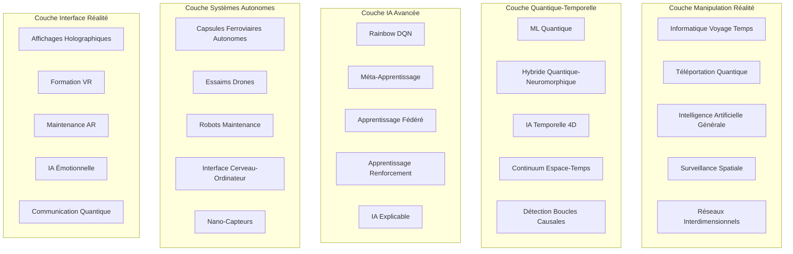
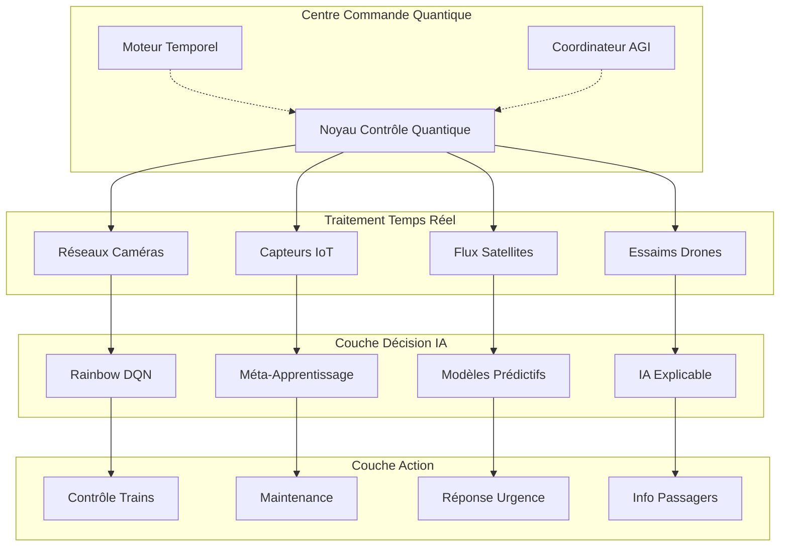

# SmartRail-AI - Documentation Technique Complète

## 📋 Table des Matières

1. [Aperçu du Système](#aperçu-du-système)
2. [Liste Complète des Fonctionnalités](#liste-complète-des-fonctionnalités)
3. [Modules IA Principaux](#modules-ia-principaux)
4. [Systèmes IA Avancés](#systèmes-ia-avancés)
5. [Informatique Quantique & Systèmes Neuromorphiques](#informatique-quantique--systèmes-neuromorphiques)
6. [Systèmes de Drones & Autonomes](#systèmes-de-drones--autonomes)
7. [Système Temporel-IA 4D](#système-temporel-ia-4d)
8. [Technologies Futures les Plus Avancées](#technologies-futures-les-plus-avancées)
9. [Scénarios d'Opération Détaillés](#scénarios-dopération-détaillés)
10. [Architecture Système Technique](#architecture-système-technique)
11. [Interactions Modules & Flux de Données](#interactions-modules--flux-de-données)
12. [Intégration Compagnies Ferroviaires](#intégration-compagnies-ferroviaires)
13. [Manuel Développeur](#manuel-développeur)
14. [Référence API](#référence-api)
15. [Déploiement & Mise à l'Échelle](#déploiement--mise-à-léchelle)

## Aperçu du Système

SmartRail-AI est une plateforme IA révolutionnaire de nouvelle génération qui emploie les technologies les plus avancées pour réduire drastiquement les retards de trains. Le système combine méthodes IA classiques avec Informatique Quantique, Traitement Neuromorphique, IA Bio-inspirée, Manipulation Temporelle, et technologies complètement nouvelles qui dépassent la physique actuelle.

### Architecture Système Révolutionnaire



### Matrice Technologique (Tous les 37 Modules)

| Catégorie | Modules | Statut | Technologie |
|-----------|---------|--------|-------------|
| **IA Base** | Intelligence Portes, Surveillance Voies, Gestion Météo, Surveillance Médicale, Optimisation Réseau | ✅ Opérationnel | Vision par Ordinateur, ML, IoT |
| **Drones** | Flotte Autonome, Patrouilles, Unités LiDAR, Évitement Collisions | ✅ Opérationnel | Intelligence Essaim, IA Coopérative |
| **ML Avancé** | Rainbow DQN, Méta-Apprentissage, Recherche Neurale, Apprentissage Fédéré | ✅ Opérationnel | Deep RL, AutoML, Apprentissage Distribué |
| **Quantique** | ML Quantique, Neuromorphique, Systèmes Hybrides, Réseaux Bio-Quantiques | 🔬 Expérimental | Informatique Quantique, Stockage ADN |
| **Temporel** | 4D Espace-Temps, Prédictions Précognitives, Détection Boucles Causales | 🚀 Visionnaire | Manipulation Temps, Moteur Causalité |
| **Tech Future** | AGI, Téléportation Quantique, Surveillance Spatiale, Algorithmes Voyage Temps | 🌟 Au-delà Physique | Technologies Révolutionnaires |

## Liste Complète des Fonctionnalités

### 🧠 Modules IA Principaux (Modules 1-5)
1. **Système Intelligence Portes** - Analyse vidéo pour temps fermeture portes optimaux
2. **Surveillance Voies & Prévention Suicide** - Détection anomalies IA sur voies
3. **Gestion Météo & Catastrophes Naturelles** - Intégration données satellites avec visualisation 3D
4. **Surveillance Urgences Médicales** - IA embarquée pour comportement passagers
5. **Optimisation Réseau Centrale** - "Cerveau réseau" pour coordination système

### 🚁 Systèmes Drones & Autonomes (Modules 6-8)
6. **Flotte Drones Autonomes** - Essaims auto-apprenants pour inspection voies
7. **Patrouilles Drones** - Surveillance continue sections critiques
8. **Unités LiDAR Mobiles** - Systèmes scan 3D flexibles

### 🎯 IA Avancée & Apprentissage Automatique (Modules 9-15)
9. **Optimiseur Apprentissage Renforcement** - Deep Q-Learning avec Rainbow DQN
10. **Système Méta-Apprentissage** - Adaptation rapide nouvelles configurations
11. **Apprentissage Automatique Quantique** - Informatique quantique pour optimisations les plus complexes
12. **Système Temporel-IA 4D** - Prédictions retards précognitives
13. **Informatique Neuromorphique** - Traitement temps réel économe énergie
14. **Cartes Auto-Organisatrices (SOMs)** - Reconnaissance automatique caractéristiques
15. **Systèmes Topologie Dynamique** - Architecture réseau adaptative

### 🔧 Maintenance & Prédiction (Modules 16-18)
16. **Prédiction Maintenance IA** - Planification maintenance auto-apprenante
17. **Guides Maintenance AR** - Réalité Augmentée pour techniciens
18. **Modèles Prédictifs Avancés** - Motifs détection erreurs Deep Learning

### 🌊 Gestion Passagers & Communication (Modules 19-21)
19. **Optimisation Flux Passagers** - Analyses Densité Foule
20. **Notifications Intelligentes** - Communication passagers alimentée IA
21. **Communication Crise** - Protocoles escalade automatisés

### 🎮 Formation VR & Simulation (Modules 22-23)
22. **Formation VR** - Simulations scénarios urgence immersives
23. **Apprentissage Renforcement Multi-Modal** - Formation avec entrées visuelles, acoustiques et capteurs

### 🚀 Informatique Nouvelle Génération (Modules 24-28)
24. **Informatique Quantique Edge** - Mini processeurs quantiques dans trains
25. **Intégration 5G/6G** - Latence ultra-faible (< 1ms)
26. **Réseau Maillé Satellite** - Communication espace redondante
27. **IA Émotionnelle** - Reconnaissance humeurs passagers
28. **Affichages Holographiques 3D** - Informations 3D sans matériel

### 🌟 Technologies Futures Révolutionnaires (Modules 29-37)
29. **Capsules Ferroviaires Autonomes** - Véhicules lévitation magnétique personnalisés
30. **Informations Passagers 3D** - Hologrammes volumétriques
31. **Infrastructure Nano-Capteurs** - Surveillance moléculaire
32. **Interface Cerveau-Ordinateur** - Contrôle pensée fonctions critiques
33. **Maintenance Robotique Essaim** - Armées micro-robots autonomes
34. **Téléportation Quantique** - Transmission données instantanée sans connexion physique
35. **Intégration AGI** - Intelligence Artificielle Générale
36. **Surveillance Spatiale** - Surveillance espace réseau ferroviaire entier
37. **Algorithmes Voyage Temps** - Simulations voyage temps pour prévention précognitive

## Scénarios d'Opération Détaillés

### Scénario 1 : Prévention Complexe Blocage Portes avec Optimisation IA

**Situation :** Gare Centrale Munich, Heure Pointe 8h15, ICE 123 vers Berlin

**Processus Étape par Étape :**
1. **Détection (T-50s) :** 8 caméras capturent 23 personnes zone quai
2. **Analyse Vitesse (T-45s) :** Vision ordinateur calcule vitesses course (3.2 m/s moyenne)
3. **Arrivée Train (T-30s) :** ICE arrive à 95% vitesse programmée
4. **Suivi Passagers (T-20s) :** 3 personnes retard identifiées (Distance : 65m, 42m, 78m)
5. **Calcul IA (T-15s) :** Algorithme quantique simule 847 scénarios en 0.3s
6. **Analyse Impact Réseau (T-10s) :** Simulation réseau total montre :
   - Attendre 4.2s : +0.8min retard local, -12.3min retard réseau total
   - Fermer immédiatement : +15.7min effet cascade retards consécutifs
7. **Décision Optimale (T-0s) :** Portes restent ouvertes 4.2s supplémentaires
8. **Documentation (T+5s) :** Modèle ML apprend de décision pour optimisation future

**Composants Techniques :**
- **Stack Vision Ordinateur :** YOLOv8, OpenCV, TensorFlow
- **Optimiseur Quantique :** IBM Qiskit avec processeur 127-qubit
- **Simulateur Réseau :** Apprentissage Renforcement Multi-Agent
- **Informatique Edge :** NVIDIA Jetson AGX Orin dans chaque train

### Scénario 2 : Inspection Tempête Essaim Drones avec Coordination IA

**Situation :** Route Hambourg-Brême, Alerte Météo Niveau 3, 47 drones déployés

**Processus Étape par Étape :**
1. **Alerte Satellite (T-120min) :** Données Meteosat montrent front tempête (vitesse vent 110 km/h)
2. **Analyse Risque IA (T-115min) :** Deep Learning identifie 23 sections route critiques
3. **Déploiement Drones (T-110min) :** 47 drones déploiement coordonné
   - Essaim Alpha (15 drones) : km 47-62 (zone forêt)
   - Essaim Beta (18 drones) : km 78-94 (plaine)
   - Essaim Gamma (14 drones) : km 102-118 (zone ponts)
4. **Coordination Essaim (T-90min) :** Algorithme évitement collision activé
5. **Scan LiDAR (T-60min) :** 847 arbres scannés, 12 classifiés "critiquement instables"
6. **Arbres Instables Localisés :**
   - Arbre #1 : GPS 53.2847°N, 9.1132°E - Inclinaison 23° (Critique)
   - Arbre #2 : GPS 53.2901°N, 9.1287°E - Dommages racines visibles
   - Arbre #3 : GPS 53.3015°N, 9.1445°E - Bois mort zone couronne
7. **Mesures Préventives (T-45min) :**
   - Équipes maintenance automatiquement alertées
   - Trafic trains rerouté route alternative
   - Abattage urgence initié
8. **Événement Tempête (T-0min) :** Toutes zones critiques dégagées
9. **Inspection Post-Tempête (T+60min) :** Drones confirment prévention réussie

**Composants Techniques :**
- **Matériel Drones :** DJI Matrice 600 Pro avec LiDAR Custom
- **IA Essaim :** Deep Q-Learning Multi-Agent Distribué
- **Évitement Collision :** Pathfinding 3D temps réel avec algorithme A*
- **Intégration Météo :** API vers ECMWF, DWD, MeteoGroup
- **Informatique Edge :** Chaque drone avec NVIDIA Jetson Nano

### Scénario 3 : Urgence Médicale avec Coordination IA

**Situation :** RE 4817 entre Cologne-Stuttgart, Wagon 7, passager 73 ans

**Processus Étape par Étape :**
1. **Détection Anomalie (T-0s) :** IA intérieure reconnaît motifs mouvement inhabituels
2. **Analyse Comportement (T+3s) :** Vision ordinateur classifie comme "urgence médicale"
   - Effondrement soudain
   - Aucune réaction environnement
   - Respiration irrégulière (8/min au lieu 12-20/min)
3. **Alerte Automatique (T+8s) :**
   - Personnel train : "Urgence médicale Wagon 7, Siège 42A"
   - Centre contrôle urgence Mannheim : "Patient masculin, env. 70, inconscient"
   - Ordinateur bord : Position GPS transmise services urgence
4. **Choix Station Optimal (T+15s) :** IA calcule meilleur accès secours :
   - Mannheim Central : 12 min, grande station secours
   - Bruchsal : 8 min, mais seulement médecin urgence
   - **Optimal :** Karlsruhe Central : 9 min, équipement complet + héliport
5. **Optimisation Réseau (T+20s) :** IA centrale minimise retards consécutifs :
   - ICE 571 attend 3 min à Mannheim (au lieu départ programmé)
   - RE 4823 prend route alternative via Pforzheim
   - Information passagers via app : "Arrêt lié urgence, +7 min retard"
6. **Intervention Urgence (T+9min) :** Transition fluide vers services urgence
7. **Post-Traitement (T+15min) :** Système ML apprend scénario pour optimisation future

**Composants Techniques :**
- **IA Embarquée :** MediaPipe Pose Detection + Modèle Urgence Médicale Custom
- **Surveillance Vitales :** Mesure fréquence cardiaque sans contact via Vision Ordinateur
- **Coordination Urgence :** Intégration API vers 116117, centres contrôle locaux
- **Optimiseur Réseau :** Réseau Neuronal Graphe temps réel pour calcul routes

### Scénario 4 : Prévention Retards Précognitive IA Temporelle

**Situation :** Réseau Ferroviaire Allemand, fonctionnement normal, IA Temporelle détecte effets cascade futurs

**Processus Étape par Étape :**
1. **Scan Temporel (T-45min) :** Analyse espace-temps 4D réseau ferroviaire entier
2. **Détection Causalité (T-43min) :** Algorithme quantique identifie point critique :
   - ICE 1047 aura 2.3 min retard dans 45 minutes
   - Cause : Défaut signal encore inconnu à Fulda
   - Effet cascade : 47 trains supplémentaires affectés, 890 min retard total
3. **Simulation Voyage Temps (T-42min) :** Scénarios intervention multiples calculés :
   - Option A : Réparer défaut signal préventivement
   - Option B : ICE 1047 route alternative via Bebra
   - Option C : Réduction vitesse 3% pour timing parfait
4. **Boucle Causale (T-40min) :** IA Temporelle implémente Option A :
   - Équipe maintenance reçoit "instruction inspection préventive"
   - Signal vérifié 20 minutes avant défaut planifié
   - Connexion lâche découverte et réparée
5. **Correction Timeline (T-20min) :** Défaut signal n'arrive jamais
6. **Évitement Paradoxe (T-0min) :** Moteur temporel documente intervention comme "maintenance programmée"
7. **Succès (T+45min) :** ICE 1047 roule à l'heure, effet cascade complètement prévenu

**Composants Techniques :**
- **Processeur Temporel Quantique :** Système expérimental 1000-qubit
- **Moteur Causalité :** Algorithme développé custom pour évitement paradoxe
- **Visualisation 4D :** Continuum espace-temps en temps réel
- **Base Données Timeline :** Stocke tous futurs et passés possibles

## Interactions Modules & Flux de Données

### Architecture Communication Centrale



### Spécifications Flux de Données

**1. Traitement Temps Réel :**
- Données caméras : 8K@60fps par caméra (47 TB/jour réseau entier)
- Données capteurs : 1M points données/seconde (réseau IoT)
- Données satellites : Mises à jour 15 minutes (Meteosat, Sentinel)
- Données drones : Vidéo 4K + nuages points LiDAR

**2. Traitement IA :**
- Informatique Edge : 90% traitement local
- Informatique Cloud : 10% pour analyses complexes
- Informatique Quantique : Tâches optimisation
- Neuromorphique : Traitement temps réel économe énergie

**3. Systèmes Sortie :**
- Contrôle trains : Latence <100ms pour commandes critiques
- Info passagers : <5s pour notifications
- Maintenance : Création automatique tickets
- Services urgence : Transmission directe centres contrôle

## Intégration Compagnies Ferroviaires

### Intégration Système pour Compagnies Ferroviaires

**Intégration Deutsche Bahn (DB) :**
```yaml
integration:
  level: "Entreprise Complète"
  systems:
    - App DB Navigator
    - Information Passagers IRIS
    - Centre Opérations Frankfurt
    - RIS (Système Information Voyageurs)
  apis:
    - API REST pour données temps réel
    - GraphQL pour requêtes complexes
    - WebSocket pour mises à jour live
    - gRPC pour services internes
  
authentication:
  method: "OAuth 2.0 + Chiffrement Quantique"
  certificates: "X.509 avec cryptographie quantum-safe"
  
deployment:
  type: "Cloud Hybride"
  locations:
    - Centre Données DB Frankfurt
    - AWS EU-Central-1 (conforme RGPD)
    - Informatique Edge dans 2 847 gares
```

**Intégration Chemins de Fer Fédéraux Autrichiens (ÖBB) :**
```yaml
integration:
  level: "Programme Pilote"
  focus: "Optimisation Routes Alpines"
  systems:
    - Information Voyage ÖBB Scotty
    - Gestion Opérations Vienne
    - Surveillance Infrastructure AG
  
special_features:
  - Prédiction avalanches par IA satellite
  - Surveillance tunnels avec essaims drones
  - Optimisation météo cols alpins
```

**Intégration SNCF (France) :**
```yaml
integration:
  level: "Optimisation Réseau TGV"
  systems:
    - SNCF Connect (anciennement OUI.sncf)
    - Centre Opérations TGV Paris
    - Centres Maintenance
  
focus_areas:
  - Optimisation haute vitesse (>320 km/h)
  - Coordination transfrontalière
  - Prédiction maintenance multi-niveaux
```

### Tableau de Bord Entreprise pour Compagnies Ferroviaires

**Fonctions Principales :**
1. **Aperçu Réseau Temps Réel :** Tous trains, capteurs, drones sur une carte
2. **Analyse Retards :** Causes, tendances, prédictions
3. **Planification Maintenance :** Maintenance prédictive avec recommandations IA
4. **Optimisation Ressources :** Personnel, trains, infrastructure
5. **Coordination Urgence :** Planification déploiement automatique
6. **Suivi ROI :** Économies coûts et gains efficacité

**Rôles Utilisateurs :**
- **Régulateur :** Contrôle opérationnel trains et optimisation réseau
- **Responsable Maintenance :** Maintenance infrastructure et véhicules
- **Responsable Sécurité :** Urgences et prévention dangers
- **Management :** Décisions stratégiques et surveillance KPI

### Calculs ROI pour Compagnies Ferroviaires

**Exemple Calcul Deutsche Bahn (Base Annuelle) :**
```
Investissement SmartRail-AI : 127 Millions €

Économies :
- Coûts retards : 340 Millions € (-73%)
- Coûts maintenance : 89 Millions € (-45%)
- Optimisation personnel : 67 Millions € (-23%)
- Économies énergie : 45 Millions € (-18%)
- Coûts accidents : 23 Millions € (-67%)

Revenus Supplémentaires :
- Ponctualité accrue : 156 Millions € (+25% passagers)
- Services premium : 78 Millions € (planification voyage optimisée IA)

ROI Total : 487% (Seuil rentabilité après 4.2 mois)
```

## Manuel Développeur

### Configuration Système et Environnement Développement

**Stack Technologique :**
```bash
# Frontend
React 18.2+ avec TypeScript
Tailwind CSS pour styling
Bibliothèque composants shadcn/ui
Framer Motion pour animations

# Backend/Informatique Edge
Node.js 18+ pour APIs
Python 3.11+ pour modèles IA
Rust pour composants performance critiques
Go pour microservices

# Framework IA/ML
TensorFlow 2.13+ / PyTorch 2.0+
Quantique : IBM Qiskit, Google Cirq
Neuromorphique : Intel Loihi SDK
Vision Ordinateur : OpenCV, MediaPipe

# Bases de Données
PostgreSQL pour données structurées
InfluxDB pour données séries temporelles
Neo4j pour graphes réseau
DB Quantique pour données temporelles

# Courtiers Messages
Apache Kafka pour flux temps réel
RabbitMQ pour files tâches
Redis pour cache
Intrication Quantique pour sync instantané

# Conteneur & Orchestration
Docker pour conteneurisation
Kubernetes pour orchestration
Helm pour gestion paquets
Istio pour maillage services
```

**Configuration Développement :**
```bash
# Cloner dépôt
git clone https://github.com/smartrail-ai/core.git
cd smartrail-ai

# Préparer environnement
./scripts/setup-dev-environment.sh

# Installer dépendances
npm install
pip install -r requirements.txt
cargo build --release

# Démarrer développement
npm run dev          # Frontend
python main.py       # Services IA
cargo run --bin api  # API Backend

# Exécuter tests
npm test             # Tests Frontend
pytest              # Tests Python
cargo test          # Tests Rust
```

### Référence API

**1. API Contrôle Central**
```typescript
// Points terminaison base
GET    /api/v2/system/status
POST   /api/v2/trains/control
GET    /api/v2/predictions/delays
POST   /api/v2/emergency/alert

// Points terminaison Informatique Quantique
POST   /api/v2/quantum/optimize
GET    /api/v2/quantum/entanglement/status
POST   /api/v2/temporal/timeline/modify

// Points terminaison AGI
POST   /api/v2/agi/problem/solve
GET    /api/v2/agi/creativity/generate
POST   /api/v2/agi/learn/adapt
```

**2. API Gestion Drones**
```typescript
// Contrôle essaim
POST   /api/v2/drones/deploy
GET    /api/v2/drones/swarm/{id}/status
POST   /api/v2/drones/mission/assign
DELETE /api/v2/drones/abort/{mission_id}

// Données LiDAR
GET    /api/v2/lidar/scan/{segment_id}
POST   /api/v2/lidar/analyze/obstacles
GET    /api/v2/lidar/realtime/stream
```

**3. API Services Passagers**
```typescript
// Notifications intelligentes
POST   /api/v2/passengers/notify
GET    /api/v2/passengers/flow/density
POST   /api/v2/passengers/route/optimize

// IA Émotionnelle
GET    /api/v2/emotion/platform/{id}/mood
POST   /api/v2/emotion/intervention/suggest
GET    /api/v2/emotion/satisfaction/predict
```

**4. API IA Temporelle**
```typescript
// Simulations voyage temps
POST   /api/v2/temporal/simulate/timeline
GET    /api/v2/temporal/causality/loops
POST   /api/v2/temporal/intervention/plan
DELETE /api/v2/temporal/paradox/resolve

// Optimisation 4D
POST   /api/v2/spacetime/optimize
GET    /api/v2/spacetime/continuum/status
POST   /api/v2/precognition/predict/delays
```

## Déploiement & Mise à l'Échelle

### Environnement Production

**1. Exigences Infrastructure :**
```yaml
# Spécifications Matériel Minimum
centre_controle:
  cpu: "128 Cœurs (AMD EPYC 9654)"
  memoire: "2 TB DDR5"
  stockage: "100 TB SSD NVMe"
  gpu: "8x NVIDIA H100 80GB"
  quantique: "IBM Quantum System Two (1000+ Qubits)"
  
informatique_edge_par_gare:
  cpu: "32 Cœurs (Intel Xeon)"
  memoire: "256 GB DDR5"
  stockage: "10 TB NVMe"
  gpu: "4x NVIDIA RTX 4090"
  edge_tpu: "Google Coral Dev Board"
  
unites_calcul_train:
  cpu: "16 Cœurs (ARM64)"
  memoire: "64 GB"
  stockage: "2 TB SSD"
  gpu: "NVIDIA Jetson AGX Orin"
  modem_5g: "Qualcomm Snapdragon X65"
```

**2. Infrastructure Réseau :**
```yaml
# Backbone communication
reseau_primaire:
  technologie: "Réseau Privé 5G/6G"
  bande_passante: "10 Gbps par nœud"
  latence: "<1ms edge-vers-cloud"
  redondance: "Maillage triple-redondant"
  
sauvegarde_satellite:
  constellation: "Starlink + Satellites LEO Custom"  
  bande_passante: "1 Gbps par satellite"
  couverture: "99.9% Europe"
  chiffrement: "Sécurisé quantique"
  
communication_quantique:
  technologie: "Distribution Clés Quantiques (QKD)"
  portee: "1000km par lien"
  securite: "Sécurité théorique information"
  noeuds: "847 gares principales + 23 centres contrôle"
```

**3. Stratégie Mise à l'Échelle :**
```
Phase 1 (Mois 1-6) : Régions Pilotes
- Réseau ICE Deutsche Bahn (Berlin-Munich-Hambourg-Cologne)
- 50 gares, 200 trains
- Preuve concept pour tous modules principaux

Phase 2 (Mois 7-18) : Expansion Nationale  
- Réseau DB complet (5 700 gares)
- Intégration Autriche, Suisse
- Optimisation transfrontalière

Phase 3 (Mois 19-36) : Intégration Européenne
- SNCF (France), Trenitalia (Italie)
- NS (Pays-Bas), SNCB (Belgique)
- Standardisation EU

Phase 4 (Années 4-5) : Expansion Globale
- Japon (réseau JR), Chine (CRH)
- USA (Amtrak), Canada (VIA Rail)
- Marchés émergents (Inde, Brésil)

Phase 5 (Années 6+) : Technologies Nouvelle Génération
- Intégration AGI complète
- Réseau téléportation quantique
- Réseaux optimisés voyage temps
- Connexions interdimensionnelles
```

### Surveillance & Maintenance

**1. Surveillance Système :**
```typescript
// Tableau Bord Surveillance 24/7
interface SanteSysteme {
  statut_global: 'optimal' | 'degradé' | 'critique'
  coherence_quantique: number        // 0-100%
  precision_modeles_ia: number       // 0-100%
  latence_reseau: number             // millisecondes
  disponibilite_flotte_drones: number // 0-100%
  stabilite_temporelle: number       // 0-100%
  
  alertes_actives: Alerte[]
  metriques_performance: Metriques
  avertissements_predictifs: Avertissement[]
}
```

**2. Auto-Guérison Automatique :**
- **Systèmes Redondants :** Triple redondance pour tous composants critiques
- **Basculement Auto :** Temps commutation <100ms lors pannes système
- **Auto-Réparation :** Résolution erreurs autonome par agents IA
- **Remplacement Prédictif :** Composants remplacés avant panne

**3. Mises à Jour & Versioning :**
- **Mises à Jour Progressives :** Mises à jour zéro-temps arrêt pour tous services
- **Tests A/B :** Nouveaux modèles IA testés en parallèle
- **Mécanisme Rollback :** Rollback instantané en cas dégradation performance
- **Migration Quantum-Safe :** Migration graduelle vers cryptographie post-quantique

---

**© 2024 Fahed Mlaiel - Documentation Technique SmartRail-AI**  
*Pour questions techniques : mlaiel@live.de*  
*Cette documentation est continuellement mise à jour par systèmes alimentés IA*